# Plan: Rewrite cbscore from Python to Rust

## Table of Contents

- [1. Context](#1-context)
- [2. Design Principles](#2-design-principles)
- [3. Architecture Overview](#3-architecture-overview)
  - [3.1 Component / Module Diagram](#31-component--module-diagram)
  - [3.2 Cargo Workspace Structure](#32-cargo-workspace-structure)
  - [3.3 Crate Dependency Graph](#33-crate-dependency-graph)
  - [3.4 Unified Class Diagram](#34-unified-class-diagram)
  - [3.5 CLI Call Graph (DAG)](#35-cli-call-graph-dag)
- [4. Coding Standards](#4-coding-standards)
  - [4.1 Documentation](#41-documentation)
  - [4.2 Git Commits](#42-git-commits)
  - [4.3 Compiler Strictness](#43-compiler-strictness)
  - [4.4 Logging & Tracing](#44-logging--tracing)
- [5. Technical Design](#5-technical-design)
  - [5.1 Root Cargo.toml](#51-root-cargotoml)
  - [5.2 Error Hierarchy](#52-error-hierarchy)
  - [5.3 Config Models (serde)](#53-config-models-serde)
  - [5.4 Secret Discriminated Unions](#54-secret-discriminated-unions)
  - [5.5 Async Command Executor](#55-async-command-executor)
  - [5.6 Vault Client](#56-vault-client)
  - [5.7 S3 Client](#57-s3-client)
  - [5.8 RAII Guards](#58-raii-guards)
  - [5.9 Dead Code from Python](#59-dead-code-from-python)
- [6. PyO3 Binding Strategy](#6-pyo3-binding-strategy)
  - [Module structure](#module-structure)
  - [Exception hierarchy](#exception-hierarchy)
  - [Types consumed as Pydantic fields](#types-consumed-as-pydantic-fields)
  - [Async runner bridge](#async-runner-bridge)
  - [CLI binary installation](#cli-binary-installation)
  - [Maturin pyproject.toml](#maturin-pyprojecttoml)
- [7. Implementation Phases & Critical Path](plan-cbscore-rs.md) *(separate document)*
- [8. Risks and Mitigations](#8-risks-and-mitigations)
- [9. Verification Plan](#9-verification-plan)
- [10. Crate Reference](#10-crate-reference)
- [11. Subcommand Detail Plans](#11-subcommand-detail-plans)


---

## 1. Context

`cbscore` (~280KB, ~9,800 lines of Python across 55 files) is the core build library of CBS. It handles Ceph RPM building, container image creation, S3 artifact management, and Vault secrets. Three Python packages depend on it: `cbsd` (heavily — runner, config, versions, components), `cbsdcore` (lightly — VersionType, CESError), and `cbc` (lightly — version utilities, errors). The CLI `cbsbuild` is also part of cbscore.

The rewrite targets: **Rust 2024 edition, Clap CLI, Tokio async, Maturin + PyO3 for Python interop**.

---

## 2. Design Principles

The following principles govern all code written for this rewrite:

**SOLID:**
- **Single Responsibility** — each struct, function, and module has exactly one reason to change. A function that builds RPMs does not also upload them. A struct that holds config does not also validate it.
- **Open/Closed** — extend behavior through traits and generics where multiple implementations exist, not by modifying existing code.
- **Liskov Substitution** — trait implementations must be interchangeable. Any trait impl works identically from the caller's perspective.
- **Interface Segregation** — keep traits small and focused. Callers depend only on what they use.
- **Dependency Inversion** — high-level modules (builder, runner) depend on abstractions (traits) where substitutability is needed. Concrete modules (S3, Vault) use direct implementations when only one backend exists.

**KISS:**
- Prefer the simplest solution that works. No speculative abstractions, no "just in case" generics.
- If a `match` is clearer than a trait hierarchy, use the `match`.
- No design patterns for the sake of patterns — only when they reduce complexity.

**DRY:**
- Extract shared logic into functions, not copy-paste. But three similar lines are better than a premature abstraction.
- Shared types live in the `types` module of `cbscore-lib`. Shared async logic lives in the top-level modules of `cbscore-lib`. No duplication across crates.
- Configuration parsing, secret resolution, and error mapping each exist in exactly one place.

**Function design:**
- Each function addresses a **single problem** — if you need an "and" to describe what it does, split it.
- Function bodies should be **10–20 lines**. Exceeding 20 lines is a signal to extract helpers.
- **Maximum 3–4 parameters**. When more are needed, group related parameters into a struct (e.g., `RunnerOpts`, `ConfigInitOptions`, `CmdOpts`).
- Use builder patterns or option structs for functions that would otherwise need many optional parameters.

---

## 3. Architecture Overview

### 3.1 Component / Module Diagram

Shows the 3 Rust crates, their internal modules, and dependencies between them. External systems and Python consumers are included at the boundaries.

```mermaid
graph TB
    subgraph Python["Python Consumers"]
        cbsd["cbsd<br/><i>Celery workers, FastAPI</i>"]
        cbsdcore["cbsdcore<br/><i>Shared daemon models</i>"]
        cbc["cbc<br/><i>CLI client</i>"]
    end

    subgraph cbscore_python["cbscore-python (cdylib)"]
        py_errors["errors.rs<br/><i>Rust→Python exception mapping</i>"]
        py_config["config.rs<br/><i>PyConfig wrapper</i>"]
        py_versions["versions.rs<br/><i>PyVersionDescriptor, VersionType</i>"]
        py_runner["runner.rs<br/><i>Async bridge via pyo3-async-runtimes</i>"]
        py_core["core.rs<br/><i>load_components wrapper</i>"]
        py_logging["logging.rs<br/><i>pyo3-log bridge</i>"]
    end

    subgraph cbsbuild_crate["cbsbuild (binary)"]
        main["main.rs<br/><i>#[tokio::main], Clap root</i>"]
        cmds_config["cmds/config.rs<br/><i>init, init-vault</i>"]
        cmds_versions["cmds/versions.rs<br/><i>create, list</i>"]
        cmds_builds["cmds/builds.rs<br/><i>build, runner build</i>"]
        cmds_advanced["cmds/advanced.rs<br/><i>empty placeholder</i>"]
        cmds_utils["cmds/utils.rs<br/><i>resolve_path, init_secrets</i>"]

        main --> cmds_config
        main --> cmds_versions
        main --> cmds_builds
        main --> cmds_advanced
        cmds_config --> cmds_utils
        cmds_versions --> cmds_utils
        cmds_builds --> cmds_utils
    end

    subgraph cbscore_lib["cbscore-lib (library)"]
        cmd["cmd.rs<br/><i>async_run_cmd, CmdArg, CmdEvent</i>"]
        runner["runner.rs<br/><i>runner(), gen_run_name(), stop()</i>"]
        vault["vault.rs<br/><i>VaultClient + VaultAuth enum (vaultrs)</i>"]
        s3_mod["s3.rs<br/><i>S3 operations (aws-sdk-s3)</i>"]
        logging_mod["logging.rs<br/><i>tracing setup</i>"]

        subgraph types_mod["types/ (pure domain types, no I/O)"]
            errors["errors.rs<br/><i>CbsError enum (~8 variants, thiserror)</i>"]
            config_types["config.rs<br/><i>Config, PathsConfig, StorageConfig, etc.</i>"]
            ver_desc["versions/desc.rs<br/><i>VersionDescriptor, VersionComponent</i>"]
            ver_utils["versions/utils.rs<br/><i>VersionType, parse_version</i>"]
            core_comp["core/component.rs<br/><i>CoreComponent, CoreComponentLoc</i>"]
            secrets_models["secrets/models.rs<br/><i>16 secret types + 4 unions</i>"]
            rel_desc["releases/desc.rs<br/><i>ReleaseDesc, ReleaseComponent,<br/>ReleaseComponentVersion, ArchType, BuildType</i>"]
            ctr_desc["containers/desc.rs<br/><i>ContainerDescriptor + template vars</i>"]
            img_desc["images/desc.rs<br/><i>ImageDescriptor</i>"]
        end

        subgraph secrets_mod["secrets/"]
            secrets_mgr["mgr.rs<br/><i>SecretsMgr</i>"]
            secrets_git["git.rs<br/><i>SSH key RAII guard</i>"]
            secrets_storage["storage.rs<br/><i>S3 credential resolution</i>"]
            secrets_signing["signing.rs<br/><i>GPG keyring RAII guard</i>"]
            secrets_registry["registry.rs<br/><i>Registry credentials</i>"]
            secrets_utils["utils.rs<br/><i>find_best_secret_candidate</i>"]
        end

        subgraph utils_mod["utils/"]
            utils_git["git.rs<br/><i>clone, checkout, worktree, fetch</i>"]
            utils_podman["podman.rs<br/><i>podman_run, podman_stop</i>"]
            utils_buildah["buildah.rs<br/><i>BuildahContainer</i>"]
            utils_containers["containers.rs<br/><i>canonical URI</i>"]
            utils_uris["uris.rs<br/><i>matches_uri</i>"]
        end

        subgraph builder_mod["builder/"]
            builder_build["build.rs<br/><i>Builder struct + run()</i>"]
            builder_prepare["prepare.rs<br/><i>prepare_builder, prepare_components</i>"]
            builder_rpmbuild["rpmbuild.rs<br/><i>build_rpms (parallel)</i>"]
            builder_signing["signing.rs<br/><i>sign_rpms (GPG)</i>"]
            builder_upload["upload.rs<br/><i>s3_upload_rpms</i>"]
        end

        subgraph containers_mod["containers/"]
            ctr_build["build.rs<br/><i>ContainerBuilder</i>"]
            ctr_component["component.rs<br/><i>ComponentContainer</i>"]
            ctr_repos["repos.rs<br/><i>ContainerRepo enum (File/URL/COPR)</i>"]
        end

        subgraph images_mod["images/"]
            img_skopeo["skopeo.rs<br/><i>inspect, copy, tags</i>"]
            img_signing["signing.rs<br/><i>cosign Transit</i>"]
            img_sync["sync.rs<br/><i>image sync</i>"]
        end

        subgraph releases_mod["releases/"]
            rel_s3["s3.rs<br/><i>check/upload releases</i>"]
            rel_utils["utils.rs<br/><i>component release RPM</i>"]
        end

        subgraph versions_mod["versions/"]
            ver_create["create.rs<br/><i>version_create_helper</i>"]
        end

        %% Internal dependencies
        runner --> cmd
        runner --> utils_podman
        builder_build --> builder_prepare
        builder_build --> builder_rpmbuild
        builder_build --> builder_signing
        builder_build --> builder_upload
        builder_build --> ctr_build
        builder_rpmbuild --> cmd
        builder_signing --> cmd
        ctr_build --> utils_buildah
        utils_git --> cmd
        utils_podman --> cmd
        utils_buildah --> cmd
        img_skopeo --> cmd
        img_signing --> cmd
        secrets_mgr --> vault
        secrets_mgr --> secrets_git
        secrets_mgr --> secrets_storage
        secrets_mgr --> secrets_signing
        secrets_mgr --> secrets_registry
        builder_upload --> s3_mod
        rel_s3 --> s3_mod
        s3_mod --> secrets_mgr
    end

    subgraph external["External Systems"]
        ext_git["Git"]
        ext_podman["Podman"]
        ext_buildah["Buildah"]
        ext_skopeo["Skopeo"]
        ext_cosign["Cosign"]
        ext_dnf["dnf"]
        ext_rpmbuild["rpmbuild / mock"]
        ext_rpm["rpm --addsign"]
        ext_s3["S3 / Ceph RGW"]
        ext_vault["HashiCorp Vault"]
        ext_registry["Container Registry"]
    end

    %% Crate dependencies
    cbsbuild_crate --> cbscore_lib
    cbscore_python --> cbscore_lib

    %% Python consumer dependencies
    cbsd --> cbscore_python
    cbsdcore --> cbscore_python
    cbc --> cbscore_python

    %% External tool dependencies
    utils_git --> ext_git
    utils_podman --> ext_podman
    utils_buildah --> ext_buildah
    img_skopeo --> ext_skopeo
    img_signing --> ext_cosign
    builder_prepare --> ext_dnf
    builder_rpmbuild --> ext_rpmbuild
    builder_signing --> ext_rpm
    s3_mod --> ext_s3
    vault --> ext_vault
    utils_buildah --> ext_registry

    %% Styling
    classDef lib fill:#81c784,color:#fff,stroke:#4caf50
    classDef cli fill:#64b5f6,color:#fff,stroke:#2196f3
    classDef pybridge fill:#ffb74d,color:#fff,stroke:#ff9800
    classDef consumer fill:#e0e0e0,color:#333,stroke:#9e9e9e
    classDef external fill:#ef5350,color:#fff,stroke:#c62828

    class cbscore_lib lib
    class cbsbuild_crate cli
    class cbscore_python pybridge
    class Python consumer
    class external external
```



**Crate roles:**

| Crate | Role | Dependencies | Consumers |
|-------|------|-------------|-----------|
| **cbscore-lib** | Core library: pure domain types, errors, serde models in `types/` module; async subprocess execution, S3, Vault, builder pipeline, runner in top-level modules. | anyhow, thiserror, serde, regex, strum, tokio, aws-sdk-s3, vaultrs, tracing | cbsbuild, cbscore-python |
| **cbsbuild** | CLI binary: Clap command tree, interactive prompts, tokio runtime owner. | cbscore-lib, clap, dialoguer, anyhow | End users, entrypoint script |
| **cbscore-python** | PyO3 bindings: thin wrappers exposing Rust types and async functions to Python. | cbscore-lib, pyo3, pyo3-async-runtimes | cbsd, cbsdcore, cbc |

### 3.2 Cargo Workspace Structure

Place the Rust workspace inside `cbscore/`:

```
cbscore/
├── Cargo.toml                      # Workspace root
├── pyproject.toml                   # Maturin build config (replaces uv_build)
├── rust/
│   ├── cbscore-lib/                 # Core library — types, async operations, S3, Vault, builder, runner
│   │   ├── Cargo.toml
│   │   └── src/
│   │       ├── lib.rs               # pub mod types; pub mod cmd; etc.
│   │       ├── logging.rs           # tracing-based logging
│   │       ├── cmd.rs               # CmdArg, async_run_cmd, run_cmd, SecureArg types
│   │       ├── runner.rs            # runner(), gen_run_name(), stop()
│   │       ├── vault.rs             # VaultClient + VaultAuth enum (vaultrs)
│   │       ├── s3.rs                # S3 operations (aws-sdk-s3)
│   │       ├── types.rs             # mod declarations for types submodules (pure domain types, no I/O)
│   │       ├── types/
│   │       │   ├── errors.rs        # CbsError enum (~8 variants, thiserror)
│   │       │   ├── config.rs        # Config, PathsConfig, StorageConfig, etc. (serde)
│   │       │   ├── versions.rs      # mod declarations for versions submodules
│   │       │   ├── versions/
│   │       │   │   ├── desc.rs      # VersionDescriptor, VersionImage, etc.
│   │       │   │   └── utils.rs     # VersionType, parse_version, parse_component_refs
│   │       │   ├── core.rs          # mod declarations for core submodules
│   │       │   ├── core/
│   │       │   │   └── component.rs # CoreComponent, CoreComponentLoc, load_components
│   │       │   ├── secrets.rs       # mod declarations for secrets submodules
│   │       │   ├── secrets/
│   │       │   │   └── models.rs    # All 16 secret types + 4 discriminated unions
│   │       │   ├── releases.rs      # mod declarations for releases submodules
│   │       │   ├── releases/
│   │       │   │   └── desc.rs      # ArchType, BuildType, ReleaseDesc, etc.
│   │       │   ├── containers.rs    # mod declarations for containers submodules
│   │       │   ├── containers/
│   │       │   │   └── desc.rs      # ContainerDescriptor (with template variable substitution), repos, scripts
│   │       │   ├── images.rs        # mod declarations for images submodules
│   │       │   └── images/
│   │       │       └── desc.rs      # ImageDescriptor
│   │       ├── secrets.rs           # mod declarations for secrets submodules
│   │       ├── secrets/
│   │       │   ├── mgr.rs           # SecretsMgr
│   │       │   ├── git.rs           # SSH key setup, git_url_for
│   │       │   ├── storage.rs       # S3 credential resolution
│   │       │   ├── signing.rs       # GPG keyring creation
│   │       │   ├── registry.rs      # Registry credential resolution
│   │       │   └── utils.rs         # find_best_secret_candidate
│   │       ├── utils.rs             # mod declarations for utils submodules
│   │       ├── utils/
│   │       │   ├── git.rs           # run_git, git_clone, git_checkout, etc.
│   │       │   ├── podman.rs        # podman_run, podman_stop
│   │       │   ├── buildah.rs       # BuildahContainer, buildah_new_container
│   │       │   ├── containers.rs    # get_container_canonical_uri
│   │       │   ├── paths.rs         # Script path resolution
│   │       │   └── uris.rs          # matches_uri
│   │       ├── builder.rs           # mod declarations for builder submodules
│   │       ├── builder/
│   │       │   ├── build.rs         # Builder struct with run()
│   │       │   ├── prepare.rs       # prepare_builder, prepare_components
│   │       │   ├── rpmbuild.rs      # build_rpms, ComponentBuild
│   │       │   ├── signing.rs       # sign_rpms (GPG)
│   │       │   └── upload.rs        # s3_upload_rpms
│   │       ├── containers.rs        # mod declarations for containers submodules
│   │       ├── containers/
│   │       │   ├── build.rs         # ContainerBuilder
│   │       │   ├── component.rs     # ComponentContainer
│   │       │   └── repos.rs         # ContainerRepo enum (File/URL/COPR) + install()
│   │       ├── images.rs            # mod declarations for images submodules
│   │       ├── images/
│   │       │   ├── skopeo.rs        # skopeo_get_tags, _copy, _inspect, _image_exists
│   │       │   ├── signing.rs       # cosign signing
│   │       │   └── sync.rs          # Image sync
│   │       ├── releases.rs          # mod declarations for releases submodules
│   │       ├── releases/
│   │       │   ├── s3.rs            # check_release_exists, release_desc_upload, etc.
│   │       │   └── utils.rs         # get_component_release_rpm
│   │       ├── versions.rs          # mod declarations for versions submodules
│   │       └── versions/
│   │           └── create.rs        # version_create_helper
│   │
│   ├── cbscore-python/              # PyO3 bindings — thin wrapper
│   │   ├── Cargo.toml
│   │   └── src/
│   │       ├── lib.rs               # #[pymodule] _cbscore
│   │       ├── errors.rs            # Rust error → Python exception mapping
│   │       ├── config.rs            # PyConfig wrapper
│   │       ├── versions.rs          # PyVersionDescriptor, version funcs
│   │       ├── runner.rs            # Async runner bridge
│   │       ├── core.rs              # load_components wrapper
│   │       └── logging.rs           # set_debug_logging wrapper
│   │
│   └── cbsbuild/                    # CLI binary
│       ├── Cargo.toml
│       └── src/
│           ├── main.rs              # #[tokio::main], Clap root
│           └── cmds/
│               ├── mod.rs
│               ├── builds.rs        # build, runner build
│               ├── versions.rs      # versions create, versions list
│               ├── config.rs        # config init, config init-vault (dialoguer)
│               └── advanced.rs      # Placeholder
│
└── src/cbscore/                     # Python package (transitional shims → removed in Phase 10)
    ├── __init__.py                  # Re-exports from _cbscore
    ├── _exceptions.py               # Python exception hierarchy (used by PyO3 error mapping)
    ├── errors.py                    # Re-exports from _exceptions
    ├── config.py                    # Re-exports from _cbscore
    ├── logger.py                    # Re-exports from _cbscore
    ├── runner.py                    # Async bridge wrapping Rust runner
    ├── __main__.py                  # CLI entry (transitional, replaced by cbsbuild binary)
    ├── versions/
    │   ├── __init__.py
    │   ├── utils.py                 # Re-exports from _cbscore
    │   ├── desc.py                  # Re-exports from _cbscore
    │   ├── create.py                # Re-exports from _cbscore
    │   └── errors.py                # Re-exports from _exceptions
    └── core/
        ├── __init__.py
        └── component.py             # Re-exports from _cbscore
```

### 3.3 Crate Dependency Graph

```
cbscore-lib    (anyhow, thiserror, serde, regex, strum, tokio, tokio-util, aws-sdk-s3, vaultrs, tracing)
    ↑
    ├── cbsbuild        (cbscore-lib, clap, dialoguer, anyhow)
    └── cbscore-python  (cbscore-lib, pyo3, pyo3-async-runtimes, pyo3-log)
```

The `types` module within cbscore-lib contains the pure domain types (errors, config, versions, releases, images, secrets models, containers descriptors). These modules use only synchronous I/O (serde, `std::fs`) and do not depend on tokio or async. The separation is maintained at the module level rather than the crate level.

### 3.4 Unified Class Diagram

Combined data model across all subcommands. Classes are grouped by domain: configuration, versions, releases, builder, and CLI.

```mermaid
classDiagram
    direction TB

    %% ── Configuration Domain ──────────────────────────────

    class Config {
        +PathsConfig paths
        +Option~StorageConfig~ storage
        +Option~SigningConfig~ signing
        +Option~LoggingConfig~ logging
        +Vec~PathBuf~ secrets
        +Option~PathBuf~ vault
        +Option~PathBuf~ versions_dir
        +load(path: &Path) Result~Config~
        +store(&self, path: &Path) Result~()~
    }

    class PathsConfig {
        +Vec~PathBuf~ components
        +PathBuf scratch
        +PathBuf scratch_containers
        +Option~PathBuf~ ccache
    }

    class StorageConfig {
        +Option~S3StorageConfig~ s3
        +Option~RegistryStorageConfig~ registry
    }

    class S3StorageConfig {
        +String url
        +S3LocationConfig artifacts
        +S3LocationConfig releases
    }

    class S3LocationConfig {
        +String bucket
        +String loc
    }

    class RegistryStorageConfig {
        +String url
    }

    class SigningConfig {
        +Option~String~ gpg
        +Option~String~ transit
    }

    class LoggingConfig {
        +PathBuf log_file
    }

    class VaultConfig {
        +String vault_addr
        +VaultAuth auth
        +load(path: &Path) Result~VaultConfig~
        +store(&self, path: &Path) Result~()~
    }

    class VaultAuth {
        <<enumeration>>
        UserPass(username, password)
        AppRole(role_id, secret_id)
        Token(String)
    }

    Config *-- PathsConfig
    Config *-- StorageConfig : optional
    Config *-- SigningConfig : optional
    Config *-- LoggingConfig : optional
    StorageConfig *-- S3StorageConfig : optional
    StorageConfig *-- RegistryStorageConfig : optional
    S3StorageConfig *-- S3LocationConfig : artifacts
    S3StorageConfig *-- S3LocationConfig : releases
    VaultConfig *-- VaultAuth

    %% ── Version Domain ────────────────────────────────────

    class VersionDescriptor {
        +String version
        +String title
        +VersionSignedOffBy signed_off_by
        +VersionImage image
        +Vec~VersionComponent~ components
        +String distro
        +i32 el_version
        +read(path: &Path) Result~VersionDescriptor~
        +write(&self, path: &Path) Result~()~
    }

    class VersionSignedOffBy {
        +String user
        +String email
    }

    class VersionImage {
        +String registry
        +String name
        +String tag
    }

    class VersionComponent {
        +String name
        +String repo
        +String r#ref
    }

    class VersionType {
        <<enumeration>>
        Release
        Dev
        Test
        Ci
    }

    VersionDescriptor *-- VersionSignedOffBy
    VersionDescriptor *-- VersionImage
    VersionDescriptor *-- VersionComponent : 1..*

    %% ── Core Component Domain ─────────────────────────────

    class CoreComponent {
        +String name
        +String repo
        +CoreComponentBuildSection build
        +CoreComponentContainersSection containers
    }

    class CoreComponentLoc {
        +PathBuf path
        +CoreComponent comp
    }

    CoreComponentLoc *-- CoreComponent

    %% ── Release Domain ────────────────────────────────────

    class ReleaseDesc {
        +String version
        +HashMap~ArchType, ReleaseBuildEntry~ builds
        +load(path: &Path) Result~ReleaseDesc~
    }

    class ReleaseBuildEntry {
        +ArchType arch
        +BuildType build_type
        +String os_version
        +HashMap~String, ReleaseComponentVersion~ components
    }

    class ReleaseComponent {
        +String name
        +String version
        +String sha1
        +Vec~ReleaseComponentVersion~ versions
    }

    class ReleaseComponentVersion {
        +String name
        +String version
        +String sha1
        +ArchType arch
        +BuildType build_type
        +String os_version
        +String repo_url
        +ReleaseRPMArtifacts artifacts
    }

    class ReleaseRPMArtifacts {
        +String loc
        +String release_rpm_loc
    }

    class ArchType {
        <<enumeration>>
        x86_64
    }

    class BuildType {
        <<enumeration>>
        rpm
    }

    ReleaseDesc *-- ReleaseBuildEntry : per architecture
    ReleaseComponent *-- ReleaseComponentVersion : per build variant
    ReleaseBuildEntry *-- ReleaseComponentVersion : per component
    ReleaseComponentVersion *-- ReleaseRPMArtifacts
    ReleaseBuildEntry --> ArchType
    ReleaseBuildEntry --> BuildType

    %% ── Builder Domain ────────────────────────────────────

    class Builder {
        -VersionDescriptor desc
        -Config config
        -PathBuf scratch_path
        -HashMap~String, CoreComponentLoc~ components
        -Option~StorageConfig~ storage_config
        -Option~SigningConfig~ signing_config
        -SecretsMgr secrets
        -Option~PathBuf~ ccache_path
        -BuildFlags flags
        +new(desc, config, flags) Result~Builder~
        +run(&self) Result~()~
    }

    class BuildFlags {
        +bool skip_build
        +bool force
        +bool tls_verify
    }

    class ContainerBuilder {
        -VersionDescriptor desc
        -ReleaseDesc release_desc
        -HashMap~String, CoreComponentLoc~ components
        +new(desc, release_desc, components) ContainerBuilder
        +build(&self) Result~()~
        +finish(&self, secrets, sign_with_transit) Result~()~
    }

    Builder --> BuildFlags
    Builder --> Config : reads
    Builder --> VersionDescriptor : reads
    Builder --> CoreComponentLoc : loads
    Builder --> ReleaseDesc : produces
    Builder --> ContainerBuilder : creates
    ContainerBuilder --> ReleaseDesc : reads

    %% ── Runner / CLI Domain ───────────────────────────────

    class RunnerOpts {
        +Option~String~ run_name
        +bool replace_run
        +Option~PathBuf~ entrypoint_path
        +f64 timeout
        +Option~PathBuf~ log_file_path
        +Option~CmdEventCallback~ log_out_cb
        +bool skip_build
        +bool force
        +bool tls_verify
        +CancellationToken cancel_token
    }

    class MountSources {
        +PathBuf desc_path
        +PathBuf cbscore_path
        +PathBuf entrypoint
        +PathBuf config_tmp
        +PathBuf secrets_tmp
        +PathBuf components_dir
    }

    note for MountSources "Fields use borrowed &'a Path at runtime.\nMermaid cannot express lifetimes;\nsee subcmd-build.md for the actual struct."

    class ConfigInitOptions {
        +Option~Vec~PathBuf~~ components
        +Option~PathBuf~ scratch
        +Option~PathBuf~ containers_scratch
        +Option~PathBuf~ ccache
        +Option~Vec~PathBuf~~ secrets
        +Option~PathBuf~ vault
    }

    class VersionCreateRequest {
        +String version
        +String version_type_name
        +HashMap~String, String~ component_refs
        +Vec~PathBuf~ components_paths
        +HashMap~String, String~ component_uri_overrides
        +String distro
        +i32 el_version
        +String registry
        +String image_name
        +Option~String~ image_tag
        +VersionSignedOffBy sign_off
    }

    RunnerOpts --> MountSources : builds
    RunnerOpts --> Config : creates container config

    %% ── CLI Command Enums ─────────────────────────────────

    class ConfigCmd {
        <<enumeration>>
        Init(ConfigInitArgs)
        InitVault(ConfigInitVaultArgs)
    }

    class VersionsCmd {
        <<enumeration>>
        Create(VersionsCreateArgs)
        List(VersionsListArgs)
    }

    class RunnerCmd {
        <<enumeration>>
        Build(RunnerBuildArgs)
    }

    class BuildArgs {
        +PathBuf descriptor
        +PathBuf cbscore_path
        +Option~PathBuf~ cbs_entrypoint
        +f64 timeout
        +Option~String~ sign_with_gpg_id
        +Option~String~ sign_with_transit
        +Option~PathBuf~ log_file
        +bool skip_build
        +bool force
        +bool tls_verify
    }

    BuildArgs --> RunnerOpts : converted to
```



### 3.5 CLI Call Graph (DAG)

Directed acyclic graph showing the complete call chain from CLI commands through library functions to external tools.

```mermaid
graph TD
    %% ── CLI Root ──────────────────────────────────────────
    cbsbuild["cbsbuild<br/><i>-d/--debug, -c/--config</i>"]

    cbsbuild --> config_cmd["config"]
    cbsbuild --> versions_cmd["versions"]
    cbsbuild --> build_cmd["build DESCRIPTOR"]
    cbsbuild --> runner_cmd["runner <i>(hidden)</i>"]
    cbsbuild --> advanced_cmd["advanced <i>(hidden, empty)</i>"]

    %% ── config init ──────────────────────────────────────
    config_cmd --> config_init["config init"]
    config_cmd --> config_init_vault_cmd["config init-vault"]

    config_init --> config_init_paths["config_init_paths()"]
    config_init --> config_init_storage["config_init_storage()"]
    config_init --> config_init_signing["config_init_signing()"]
    config_init --> config_init_secrets["config_init_secrets_paths()"]
    config_init --> config_store["Config::store()"]

    config_init_paths --> dialoguer["dialoguer<br/><i>Confirm, Input, Password</i>"]
    config_init_storage --> dialoguer
    config_init_signing --> dialoguer
    config_init_secrets --> dialoguer
    config_store --> fs_yaml["Filesystem<br/><i>YAML write</i>"]

    %% ── config init-vault ────────────────────────────────
    config_init_vault_cmd --> config_init_vault_fn["config_init_vault()"]
    config_init_vault_fn --> validate_vault_addr["validate_vault_addr()"]
    config_init_vault_fn --> prompt_vault_auth["prompt_vault_auth()"]
    config_init_vault_fn --> vault_store["VaultConfig::store()"]

    validate_vault_addr --> url_crate["url::Url::parse()"]
    prompt_vault_auth --> dialoguer
    vault_store --> fs_yaml

    %% ── versions create ──────────────────────────────────
    versions_cmd --> versions_create["versions create VERSION"]
    versions_cmd --> versions_list["versions list"]

    versions_create --> get_sign_off["get_sign_off()"]
    versions_create --> parse_refs["parse_component_refs()"]
    versions_create --> version_create_helper["version_create_helper()"]
    versions_create --> resolve_output["resolve_output_dir()"]
    versions_create --> write_desc["VersionDescriptor::write()"]
    versions_create --> check_image["get_image_desc()"]

    get_sign_off --> git_user["get_git_user()"]
    git_user --> git["git"]
    resolve_output --> git_root["get_git_repo_root()"]
    git_root --> git
    version_create_helper --> load_components["load_components()"]
    load_components --> fs_yaml_read["Filesystem<br/><i>YAML read</i>"]
    write_desc --> fs_json["Filesystem<br/><i>JSON write</i>"]

    %% ── versions list ────────────────────────────────────
    versions_list --> init_secrets["init_secrets()"]
    versions_list --> resolve_s3["resolve_s3_params()"]
    versions_list --> list_releases["list_releases()"]
    versions_list --> display["display_releases()"]

    init_secrets --> secrets_mgr["SecretsMgr::new()"]
    secrets_mgr --> vault_api["Vault API<br/><i>AppRole / UserPass / Token</i>"]
    list_releases --> s3_list["s3_list()"]
    list_releases --> s3_download["s3_download_str_obj()<br/><i>parallel via JoinSet</i>"]
    s3_list --> s3["S3 / Ceph RGW"]
    s3_download --> s3

    %% ── build (host-side) ────────────────────────────────
    build_cmd --> apply_signing["apply_signing_overrides()"]
    build_cmd --> validate_log["validate_log_file()"]
    build_cmd --> validate_secrets_fn["validate_secrets()"]
    build_cmd --> runner_fn["runner()"]

    runner_fn --> validate_entry["validate_entrypoint()"]
    runner_fn --> read_desc["VersionDescriptor::read()"]
    runner_fn --> setup_comp["setup_components_dir()"]
    runner_fn --> create_ctr_config["create_container_config()"]
    runner_fn --> build_mounts["build_volume_mounts()"]
    runner_fn --> podman_run["podman_run()"]
    runner_fn --> podman_stop["podman_stop()<br/><i>on CancellationToken</i>"]

    podman_run --> podman["podman run<br/><i>--security-opt label=disable<br/>--device /dev/fuse<br/>--network host</i>"]
    podman_stop --> podman

    %% ── Entrypoint (inside container) ────────────────────
    podman --> entrypoint["entrypoint.sh<br/><i>install uv, venv, cbscore</i>"]
    entrypoint --> runner_build_cmd

    %% ── runner build (container-side) ────────────────────
    runner_cmd --> runner_build_cmd["runner build --desc PATH"]

    runner_build_cmd --> load_desc_rb["VersionDescriptor::read()"]
    runner_build_cmd --> builder_new["Builder::new()"]
    runner_build_cmd --> builder_run["Builder::run()"]

    builder_new --> secrets_mgr
    builder_new --> load_components

    builder_run --> prepare["prepare()<br/><i>dnf install deps + cosign</i>"]
    builder_run --> image_exists["image_already_exists()"]
    builder_run --> resolve_release["resolve_or_build_release()"]
    builder_run --> build_container["build_container()"]

    prepare --> dnf["dnf"]
    image_exists --> skopeo_inspect["skopeo inspect"]
    skopeo_inspect --> skopeo["skopeo"]

    resolve_release --> check_release["check_release_exists()"]
    resolve_release --> build_release["build_release()"]
    check_release --> s3

    build_release --> check_components["check_released_components()<br/><i>parallel</i>"]
    build_release --> build_rpms["build_rpms()<br/><i>parallel via JoinSet</i>"]
    build_release --> sign_rpms["sign_rpms()<br/><i>parallel</i>"]
    build_release --> upload_rpms["s3_upload_rpms()"]
    build_release --> release_upload["release_desc_upload()"]

    check_components --> s3
    build_rpms --> rpmbuild["rpmbuild / mock"]
    sign_rpms --> rpm_sign["rpm --addsign<br/><i>GPG</i>"]
    upload_rpms --> s3
    release_upload --> s3

    build_container --> ctr_build["ContainerBuilder::build()"]
    build_container --> ctr_finish["ContainerBuilder::finish()"]

    ctr_build --> buildah_from["buildah from"]
    ctr_build --> buildah_run["buildah run<br/><i>PRE/POST/CONFIG scripts</i>"]
    ctr_finish --> buildah_commit["buildah commit --squash"]
    ctr_finish --> buildah_push["buildah push"]
    ctr_finish --> cosign_sign["cosign sign<br/><i>Vault Transit</i>"]

    buildah_from --> buildah["buildah"]
    buildah_run --> buildah
    buildah_commit --> buildah
    buildah_push --> registry["Container Registry"]
    cosign_sign --> cosign["cosign"]
    cosign_sign --> vault_api

    %% ── Styling ──────────────────────────────────────────
    classDef cmd fill:#4a9eff,color:#fff,stroke:#2a7fff
    classDef lib fill:#50c878,color:#fff,stroke:#30a858
    classDef ext fill:#ff6b6b,color:#fff,stroke:#dd4444
    classDef io fill:#ffa726,color:#fff,stroke:#dd8800

    class cbsbuild,config_cmd,config_init,config_init_vault_cmd,versions_cmd,versions_create,versions_list,build_cmd,runner_cmd,runner_build_cmd,advanced_cmd cmd
    class config_init_paths,config_init_storage,config_init_signing,config_init_secrets,config_store,config_init_vault_fn,validate_vault_addr,prompt_vault_auth,vault_store,get_sign_off,parse_refs,version_create_helper,resolve_output,write_desc,check_image,git_user,git_root,load_components,init_secrets,resolve_s3,list_releases,display,apply_signing,validate_log,validate_secrets_fn,runner_fn,validate_entry,read_desc,setup_comp,create_ctr_config,build_mounts,load_desc_rb,builder_new,builder_run,prepare,image_exists,resolve_release,build_release,build_container,check_release,check_components,build_rpms,sign_rpms,upload_rpms,release_upload,ctr_build,ctr_finish,secrets_mgr,s3_list,s3_download lib
    class git,podman,skopeo,dnf,rpmbuild,rpm_sign,buildah,cosign,registry,vault_api,s3 ext
    class dialoguer,url_crate,fs_yaml,fs_yaml_read,fs_json,entrypoint,podman_run,podman_stop,skopeo_inspect,buildah_from,buildah_run,buildah_commit,buildah_push,cosign_sign io
```



**Legend:**
- Blue: CLI commands (Clap handlers)
- Green: Library functions (cbscore-lib)
- Red: External tools and services (git, podman, buildah, skopeo, cosign, dnf, rpmbuild, S3, Vault, registry)
- Orange: I/O operations and tool wrappers

---

## 4. Coding Standards

### 4.1 Documentation

All public functions, structs, enums, traits, and methods must have `///` doc comments. This is enforced via `#![warn(missing_docs)]` at the crate level for all three crates. Doc comments should describe:
- **What** the item does (not how — the code shows that)
- **Parameters** and return values for non-obvious signatures
- **Errors** — which error variants can be returned
- **Panics** — if the function can panic, document when

Private functions should have doc comments when the intent is not self-evident from the name and signature.

### 4.2 Git Commits

Commits follow the existing project style (see `main` branch). Each commit must be **as small as possible** with a clear, single-purpose subject.

**Format:**

```
<scope>: <subject in lowercase imperative>

<why — motivation, the problem or need that prompted this change>

Signed-off-by: Name <email>
```

Trailers are managed by tooling, not hardcoded in the message:
- `Signed-off-by` is added by `git commit -s`
- `Co-Authored-By` for AI attribution is added automatically by the Claude Code harness

**Rules:**

- **Scope**: Use the crate or module name (`cbscore`, `cbscore/builder`, `cbscore/types`, `cbsbuild`, `cbscore-python`)
- **Subject**: Lowercase imperative, max 72 characters including the scope prefix (e.g., `add serde rename for ref keyword`, `fix tls-verify flag parsing`). The subject says *what* changed — it should be self-explanatory from the diff.
- **Body**: Explain *why* the change was made. 1-3 lines. Omit for trivial changes where the subject is sufficient.
- **One logical change per commit**: Don't mix unrelated changes. A single function fix is one commit. A new module is one commit. Refactoring + feature is two commits.
- **DCO required**: Always use `git commit -s` for the `Signed-off-by` line
- **GPG signing required**: Enforced by project hooks (do not bypass with `--no-verify`)

**Examples:**

```
cbscore: let skopeo handle local registries

If the image is pushed to a local container registry with a
self-signed certificate, skopeo must not verify the certificate
to avoid errors.

Signed-off-by: Name <email>
```

```
cbscore/builder: ignore cosign install if already installed
```

```
cbsd/auth: remove plaintext token logging
```

### 4.3 Compiler Strictness

Warnings must be treated as errors. All crates must enable maximum lint strictness at the crate root:

```rust
#![deny(warnings)]
#![deny(clippy::all)]
#![warn(clippy::pedantic)]
#![warn(clippy::nursery)]
#![warn(missing_docs)]
#![deny(unsafe_code)]
```

If a specific warning cannot be addressed, it must be suppressed with `#[allow(...)]` at the narrowest possible scope (on the specific item, not the module), accompanied by a justification comment:

```rust
#[allow(clippy::module_name_repetitions)] // Required by PyO3 naming convention
pub struct PyVersionDescriptor { ... }
```

The workspace `Cargo.toml` should also enforce lints globally:

```toml
[workspace.lints.rust]
warnings = "deny"
unsafe_code = "deny"
missing_docs = "warn"

[workspace.lints.clippy]
all = "deny"
pedantic = "warn"
nursery = "warn"
```

Each crate inherits via:
```toml
[lints]
workspace = true
```

### 4.4 Logging & Tracing

Use the `tracing` ecosystem for structured, hierarchical logging. Log levels can be set **per module** at runtime via environment variable — no recompilation needed.

**Crate roles:**

| Crate | Logging dependency | Role |
|-------|-------------------|------|
| `cbscore-lib` | `tracing` | Emit log events (all library modules including types) |
| `cbsbuild` (CLI) | `tracing-subscriber` with `env-filter` | Initialize the subscriber, configure output format and filtering |
| `cbscore-python` | `pyo3-log` | Bridge Rust `tracing`/`log` events into Python's `logging` module |

**Per-module filtering via `RUST_LOG`:**

The `tracing-subscriber` `EnvFilter` reads the `RUST_LOG` environment variable at startup. Examples:

```bash
# Global info, but debug for the builder module
RUST_LOG=info,cbscore_lib::builder=debug cbsbuild build desc.json

# Trace-level for git operations only
RUST_LOG=warn,cbscore_lib::utils::git=trace cbsbuild build desc.json

# Debug everything in cbscore-lib
RUST_LOG=cbscore_lib=debug cbsbuild build desc.json
```

This provides per-module granularity without recompilation.

**CLI initialization** (`cbsbuild/src/main.rs`):

```rust
use tracing_subscriber::{EnvFilter, fmt::format::FmtSpan};

fn init_logging(debug: bool) {
    let default_filter = if debug { "debug" } else { "info" };
    let filter = EnvFilter::try_from_default_env()
        .unwrap_or_else(|_| EnvFilter::new(default_filter));

    tracing_subscriber::fmt()
        .with_env_filter(filter)
        .with_target(true)
        .with_span_events(FmtSpan::NEW | FmtSpan::CLOSE)  // Emit log line on span entry and close (with duration)
        .init();
}
```

The `--debug` / `-d` CLI flag sets the default to `debug`, but `RUST_LOG` always takes precedence when set, allowing fine-grained control.

**PyO3 bridge** (`cbscore-python/src/lib.rs`):

```rust
#[pymodule]
fn _cbscore(m: &Bound<'_, PyModule>) -> PyResult<()> {
    // Bridge Rust log/tracing events to Python's logging module.
    // Events appear under the "cbscore" Python logger hierarchy,
    // mirroring the Python code's existing logger.getChild() pattern.
    pyo3_log::init();
    // ...
}
```

When called from Python (cbsd), log levels are controlled by Python's `logging` configuration rather than `RUST_LOG`. The `pyo3-log` crate maps Rust log levels to Python levels (`tracing::debug!` → `logging.DEBUG`, etc.).

**Module-level span pattern:**

Each module should use `tracing` spans or the module path target to maintain the hierarchical logger structure from the Python code (`logger.getChild("builder")`):

```rust
// In cbscore-lib/src/builder/build.rs
use tracing::{info, debug, error};

pub async fn run(&self) -> Result<(), CbsError> {
    info!("preparing builder");
    // tracing automatically includes the module path as the target:
    // cbscore_lib::builder::build
}
```

**Function entry/exit tracing via `#[instrument]`:**

All public and significant private functions must be annotated with `#[tracing::instrument]` at `TRACE` level. This automatically logs function entry (with argument values) and exit (with duration) without manual `trace!("entering...")` / `trace!("exiting...")` calls.

How it works:
- `#[instrument]` wraps the function body in a `tracing::Span`
- All log events emitted inside the function carry the span's context (function name + arguments) automatically
- For async functions, the span is correctly attached across `.await` points
- **Important**: The subscriber must be configured with `FmtSpan::NEW | FmtSpan::CLOSE` (see `init_logging` above) to emit log lines on span creation (function entry) and span close (function exit with `time.busy` and `time.idle` duration fields). Without this, `#[instrument]` provides nested context but no discrete entry/exit log lines.

```rust
use tracing::instrument;

#[instrument(skip(secrets, config), level = "trace")]
pub async fn runner(
    desc_file_path: &Path,
    cbscore_path: &Path,
    config: &Config,
    secrets: &SecretsMgr,
    opts: RunnerOpts,
) -> Result<(), CbsError> {
    // Entry logged automatically at TRACE:
    //   TRACE runner{desc_file_path="/runner/desc.json" cbscore_path="/runner/cbscore"}
    
    info!("preparing builder");
    // This INFO event carries the runner span context
    
    // Exit logged automatically at TRACE when the function returns
}
```

**Rules for `#[instrument]`:**

- Use `level = "trace"` — entry/exit tracing is off by default, only visible with `RUST_LOG=trace`
- Use `skip(...)` for large or sensitive arguments (secrets, config, file contents) to avoid bloating log output
- Use `skip_all` for functions where arguments are not useful in traces
- Use `ret` to also log the return value: `#[instrument(level = "trace", ret)]`
- Use `err` to log errors at ERROR level on `Err` return: `#[instrument(level = "trace", err)]`

```rust
// Logs entry, exit, and error (if Err returned) with argument values
#[instrument(skip(secrets), level = "trace", err)]
pub async fn check_release_exists(
    secrets: &SecretsMgr,
    url: &str,
    bucket: &str,
    bucket_loc: &str,
    version: &str,
) -> anyhow::Result<Option<ReleaseDesc>> { ... }
```

**Log level guidelines:**

| Level | Use for | Example |
|-------|---------|---------|
| `ERROR` | Failures that stop the operation | `"error building components"` |
| `WARN` | Degraded but continuing | `"no upload location provided, skip"` |
| `INFO` | Key milestones and decisions | `"image already exists — do not build"` |
| `DEBUG` | Diagnostic details | `"components contents: [...]"` |
| `TRACE` | Function entry/exit (via `#[instrument]`) | Automatic — no manual messages needed |

With `RUST_LOG=trace`, the output shows the full call chain with timing — invaluable for debugging hangs in the async subprocess pipeline (CLI → runner → podman → entrypoint → runner build → builder → rpmbuild → async_run_cmd).

**Workspace dependencies** (already present, listed here for completeness):

```toml
tracing = "0.1"
tracing-subscriber = { version = "0.3", features = ["env-filter", "json"] }
pyo3-log = "0.13"
```

---

## 5. Technical Design

### 5.1 Root Cargo.toml

```toml
[workspace]
members = ["rust/cbscore-lib", "rust/cbsbuild", "rust/cbscore-python"]
resolver = "3"

[workspace.package]
edition = "2024"
version = "2.0.0"
license = "GPL-3.0-or-later"

[workspace.dependencies]
# Error handling
thiserror = "2"
anyhow = "1"

# Serialization
serde = { version = "1", features = ["derive"] }
serde_json = "1"
serde_yml = "0.0.12"

# Logging / tracing
tracing = "0.1"
tracing-subscriber = { version = "0.3", features = ["env-filter", "json"] }

# Async runtime
tokio = { version = "1", features = ["full"] }
tokio-util = "0.7"

# CLI
clap = { version = "4", features = ["derive"] }
dialoguer = "0.12"

# PyO3
pyo3 = { version = "0.28", features = ["extension-module"] }
pyo3-async-runtimes = { version = "0.28", features = ["tokio-runtime"] }
pyo3-log = "0.13"

# Cloud / networking
aws-config = "1"
aws-sdk-s3 = "1"
reqwest = { version = "0.13", features = ["json"] }
vaultrs = "0.8"

# Utilities
regex = "1"
strum = { version = "0.28", features = ["derive"] }
dirs = "6"
url = "2"
rand = "0.10"
tempfile = "3"
```

For container deployment, consider `x86_64-unknown-linux-musl` target + `rustls` (no OpenSSL dependency) to produce fully static binaries.

### 5.2 Error Hierarchy

**Design principle**: use `thiserror` at the public API boundary (the `CbsError` enum), and `anyhow::Result` with `.context()` inside library modules. This matches how the Python codebase works — Python has only ~8 error classes (`CESError` base + 7 domain errors), and internal exceptions (subprocess failures, S3 errors, git errors, image errors) are always wrapped by the module that catches them rather than surfaced as distinct types. Callers (cbsd, cbc, cbsbuild) only pattern-match on the domain error kind, never on the underlying cause.

The top-level `CbsError` enum has ~8 variants matching the Python exception hierarchy. Internal modules (`cmd.rs`, `s3.rs`, `vault.rs`, `utils/git.rs`, `utils/podman.rs`, `utils/buildah.rs`, `images/skopeo.rs`, `releases/s3.rs`) return `anyhow::Result` and attach context with `.context()` / `.with_context()`. At module boundaries (e.g., in `builder/build.rs`, `runner.rs`, `containers/build.rs`), `anyhow::Error` is converted to the appropriate `CbsError` variant.

Maps to Python exception hierarchy via `_exceptions.py` (pure Python) + Rust `From<CbsError> for PyErr` using `GILOnceCell`-cached exception classes.

```rust
// cbscore-lib/src/types/errors.rs
#[derive(Debug, Error)]
pub enum CbsError {
    #[error("config error: {0}")]          Config(String),
    #[error("version error: {0}")]         Version(String),
    #[error("malformed version: {0}")]     MalformedVersion(String),
    #[error("no such version: {0}")]       NoSuchVersion(String),
    #[error("builder error: {0}")]         Builder(String),
    #[error("runner error: {0}")]          Runner(String),
    #[error("vault error: {0}")]           Vault(String),
    #[error("secrets error: {0}")]         Secrets(String),
    #[error(transparent)]                  Other(anyhow::Error),
}

// No `#[from] anyhow::Error` — boundary functions must explicitly map internal
// errors to the correct `CbsError` variant using
// `.map_err(|e| CbsError::Builder(format!("{e:#}")))` or similar.
// This prevents accidental silent conversion.
```

**Internal error handling**: modules that wrap external tools or perform I/O return `anyhow::Result` and use `.context()` to build an error chain. At the boundary where results flow into public API functions, convert to `CbsError`:

```rust
// Example: cbscore-lib/src/utils/git.rs (internal — uses anyhow)
pub(crate) async fn clone_repo(url: &str, dest: &Path) -> anyhow::Result<()> {
    async_run_cmd(&["git", "clone", url, dest.to_str().unwrap()], opts)
        .await
        .context("git clone failed")?;
    Ok(())
}

// Example: cbscore-lib/src/builder/build.rs (boundary — converts to CbsError)
pub async fn run(&self) -> Result<(), CbsError> {
    self.prepare().await.map_err(|e| CbsError::Builder(format!("{e:#}")))?;
    // ...
}
```

Types that were previously standalone error enums (`S3Error`, `CommandError`, `ImageError`, `GitError`, `PodmanError`, `BuildahError`, `ContainerError`, `ReleaseError`) are removed. Their error conditions are represented as `anyhow::Error` with `.context()` chains internally, and converted to the appropriate `CbsError` domain variant at module boundaries.

### 5.3 Config Models (serde)

Use `#[serde(rename_all = "kebab-case")]` on config structs to match the hyphenated YAML keys from the Python implementation (e.g., `scratch_containers` ↔ `scratch-containers`, `vault_addr` ↔ `vault-addr`). For fields where the kebab-case convention doesn't apply, use explicit `#[serde(alias = "...")]` or `#[serde(rename = "...")]`. `Config::load()` and `Config::store()` use synchronous `std::fs` in the `types` module since config I/O is simple file read/write.

### 5.4 Secret Discriminated Unions

Custom `Deserialize` implementations. Deserialize to `serde_yml::Value` first, inspect `creds` and `type` fields, then deserialize to the correct variant. This mirrors the Python discriminator functions exactly. Using `serde_yml::Value` (not `serde_json::Value`) preserves YAML line/column positions in error messages, since secret files are YAML.

**Rust keyword collision**: The `type` field used as a discriminator in 6 secret model structs (`StorageS3Secret`, `GPGPlainSecret`, `GPGVaultSingleSecret`, `GPGVaultPrivateKeySecret`, `GPGVaultPublicKeySecret`, `VaultTransitSecret`) is a strict Rust keyword. Each struct must use `r#type` as the field name (serde automatically serializes `r#type` as `"type"`) or use `type_` with `#[serde(rename = "type")]`. This is the same pattern as `VersionComponent.ref` → `r#ref`.

### 5.5 Async Command Executor

```rust
// cbscore-lib/src/cmd.rs
pub(crate) enum CmdArg {
    Plain(String),
    Secure { display: String, value: String },
}

/// Structured log events for step-level transparency.
pub enum CmdEvent {
    /// Command is about to execute (includes sanitized command line).
    Started { cmd: Vec<String> },
    /// A line was written to stdout.
    Stdout(String),
    /// A line was written to stderr.
    Stderr(String),
    /// Command finished with an exit code.
    Finished { exit_code: i32 },
}

/// Callback receiving structured command events (borrows for read, callers clone if needed).
pub type CmdEventCallback = Box<dyn Fn(&CmdEvent) + Send + Sync>;

pub(crate) struct CmdOpts {
    pub cwd: Option<PathBuf>,
    pub timeout: Option<Duration>,
    pub event_cb: Option<CmdEventCallback>,
    pub env: Option<HashMap<String, String>>,
    pub reset_python_env: bool,
}

pub(crate) async fn async_run_cmd(args: &[CmdArg], opts: &CmdOpts) -> anyhow::Result<CmdResult>;
pub(crate) fn run_cmd(args: &[CmdArg], env: Option<&HashMap<String, String>>) -> anyhow::Result<CmdResult>;
```

Uses `tokio::process::Command` with `BufReader` on stdout/stderr for streaming. Timeout via `tokio::time::timeout` with `child.kill()` on expiry. `CmdEvent` uses owned `String` fields — the source data (`BufReader::read_line`) already produces owned strings, and the events carry single log lines where allocation cost is negligible vs subprocess I/O latency.

### 5.6 Vault Client

Use the `vaultrs` crate for full Vault client support. Although only 3 endpoints are currently needed (AppRole login, UserPass login, KVv2 read), using the established crate provides better API coverage for future needs and avoids maintaining a custom HTTP client.

A single concrete `VaultClient` struct replaces the trait hierarchy originally considered. The Python code only varies by which `hvac.Client` auth method it calls (3 lines across 3 backends), and `vaultrs` already handles all 3 auth methods internally. A `VaultAuth` enum with a `match` is simpler, more idiomatic Rust, and avoids `dyn` boxing or generics infection — consistent with the KISS principle ("if a `match` is clearer than a trait hierarchy, use the `match`").

```rust
/// Authentication method for Vault.
pub(crate) enum VaultAuth {
    AppRole { role_id: String, secret_id: String },
    UserPass { username: String, password: String },
    Token(String),
}

/// Concrete Vault client. Authenticates and reads secrets via `vaultrs`.
pub(crate) struct VaultClient {
    addr: String,
    auth: VaultAuth,
}

impl VaultClient {
    /// Build a `VaultClient` from the deserialized `VaultConfig`.
    pub(crate) fn new(config: &VaultConfig) -> Result<Self> { /* match config auth type */ }

    /// Read a KVv2 secret at the given path.
    pub(crate) async fn read_secret(&self, path: &str) -> Result<HashMap<String, String>> { /* vaultrs */ }

    /// Verify that the Vault server is reachable and the credentials are valid.
    pub(crate) async fn check_connection(&self) -> Result<()> { /* vaultrs */ }
}
```

No trait is needed because there will never be a Vault backend that `vaultrs` does not already support, and `SecretsMgr` always talks to exactly one `VaultClient` instance.

### 5.7 S3 Client

Replace `aioboto3` with `aws-sdk-s3`. Explicit `Credentials::new()` from `SecretsMgr` (no env-based credential loading).

### 5.8 RAII Guards

`gpg_signing_key()` → `GpgKeyringGuard` with `Drop` that erases the temp keyring.
`git_url_for()` → `GitUrlGuard` with `Drop` that cleans up SSH key/config.

**Drop error handling**: `Drop` impls log cleanup failures at `WARN` level and never panic. Each guard provides an explicit `async fn cleanup(self) -> Result<()>` as the primary cleanup path — callers should prefer this for proper error propagation. The `Drop` impl is a best-effort fallback only, for cases where the guard is dropped without explicit cleanup (e.g. early return, panic unwinding).

### 5.9 Dead Code from Python

The following dead code was identified in the Python codebase. It must be ported to Rust and marked with `#[allow(dead_code)]` plus a comment explaining its status, so that it can be reviewed and either completed or removed:

| Item | Location | Status |
|------|----------|--------|
| `sync_image()` | `images/sync.py` | Never called anywhere in the monorepo. Port as dead code with `#[allow(dead_code)]` and `// TODO: evaluate if this function is still needed` |
| `cmd_advanced` group | `cmds/advanced.py` | Empty hidden command group with no subcommands. Port as empty Clap subcommand (hidden) |
| `desc = desc` self-assignment | `images/desc.py:84` | Bug in Python — self-assignment does nothing. Fix in Rust (remove the assignment) |
| regex bug in `_file_matches` | `images/desc.py:50` | Raw string `r"^.*{m[1]}.*.json"` contains `{m[1]}` which is not interpolated — regex matches literal braces instead of the version number. Fix in Rust by interpolating the captured group into the pattern |
| `ReleaseComponentSet` | `releases/desc.py:98` | `TypeAdapter` alias defined but never used anywhere in the codebase. Do not port to Rust |

The stray `pass` statements in Python (`builder.py:182`, `signing.py:70,152`) have no Rust equivalent and are simply not ported.

---

## 6. PyO3 Binding Strategy

### Module structure

The native extension is `cbscore._cbscore` (flat module). Python shim files in `src/cbscore/` re-export with the correct submodule paths. This avoids `sys.modules` hacks.

### Exception hierarchy

Defined in pure Python (`_exceptions.py`) with real inheritance. Rust errors map to these via cached `GILOnceCell<Py<PyAny>>` references. Only ~6 error types need distinct Python exceptions — the ones that `cbsd`, `cbc`, and `cbsdcore` actually catch. Everything else (including `CbsError::Other`) maps to the base `CESError`:

```rust
fn map_error_to_pyerr(err: CbsError) -> PyErr {
    Python::with_gil(|py| {
        let (cls_name, msg) = match &err {
            CbsError::Config(m)           => ("ConfigError", m.clone()),
            CbsError::Version(m)          => ("VersionError", m.clone()),
            CbsError::MalformedVersion(m) => ("MalformedVersionError", m.clone()),
            CbsError::NoSuchVersion(m)    => ("NoSuchVersionError", m.clone()),
            CbsError::Builder(m)          => ("CESError", m.clone()),
            CbsError::Runner(m)           => ("RunnerError", m.clone()),
            CbsError::Vault(m)            => ("CESError", m.clone()),
            CbsError::Secrets(m)          => ("CESError", m.clone()),
            CbsError::Other(e)            => ("CESError", format!("{e:#}")),
        };
        let cls = py.import("cbscore._exceptions").unwrap().getattr(cls_name).unwrap();
        PyErr::from_value(cls.call1((msg,)).unwrap())
    })
}
```

### Types consumed as Pydantic fields

`VersionDescriptor` is embedded in `cbsd`'s `WorkerBuildEntry(pydantic.BaseModel)` and serialized via `model_dump_json()`. Since the goal is to eliminate all Python code eventually, all types must be pure `#[pyclass]` in Rust.

**Strategy**: Implement `__get_pydantic_core_schema__` on `#[pyclass]` types that are used as Pydantic fields. This tells Pydantic how to validate and serialize the Rust-backed type without requiring Python inheritance from `BaseModel`.

```rust
#[pymethods]
impl PyVersionDescriptor {
    #[classmethod]
    fn __get_pydantic_core_schema__(
        cls: &Bound<'_, PyType>,
        _source_type: &Bound<'_, PyAny>,
        _handler: &Bound<'_, PyAny>,
    ) -> PyResult<PyObject> {
        let py = cls.py();
        let core_schema = py.import("pydantic_core.core_schema")?;

        // Validator: accept PyVersionDescriptor instances as-is,
        // or construct from dict via cls(**dict)
        let validator = core_schema.call_method1(
            "no_info_plain_validator_function",
            (cls.getattr("_pydantic_validate")?,),
        )?;

        // Serializer: call .to_dict() to produce a plain dict
        let serializer = core_schema.call_method1(
            "plain_serializer_function_ser_schema",
            (cls.getattr("to_dict")?,),
        )?;

        core_schema
            .call_method(
                "no_info_plain_validator_function",
                (cls.getattr("_pydantic_validate")?,),
                Some(&[("serialization", serializer)].into_py_dict(py)?),
            )?
            .extract()
    }

    #[classmethod]
    fn _pydantic_validate(cls: &Bound<'_, PyType>, value: &Bound<'_, PyAny>) -> PyResult<PyObject> {
        if value.is_instance(cls)? {
            return Ok(value.into_py_any(cls.py())?);
        }
        // dict → construct via cls(**dict)
        let dict = value.downcast::<pyo3::types::PyDict>()?;
        cls.call((), Some(dict))?.extract()
    }
}
```

This applies to `VersionDescriptor` (used in `WorkerBuildEntry`). All other types (`Config`, `CoreComponentLoc`, etc.) use plain `#[pyclass]` with getters since they are not embedded in Pydantic models.

### Async runner bridge

The `runner()` function is the critical async boundary. `cbsd` calls it via `await runner(...)` from its own asyncio event loop.

Two approaches were evaluated for the log streaming callback:

**Option 1: Sync callback bridge**
| Pros | Cons |
|------|------|
| Simple implementation (~10 lines) | Blocks tokio thread while Python callback runs |
| No extra crate dependency | GIL contention via `run_coroutine_threadsafe` |
| Easy to debug | Not truly non-blocking |
| Works with any event loop impl | Throttles build output if callback is slow |

**Option 2: Full async bridge (pyo3-async-runtimes)**
| Pros | Cons |
|------|------|
| True non-blocking end-to-end | Must match pyo3 version exactly |
| No tokio thread blocking | Complex tokio ↔ asyncio interaction |
| Better throughput at high log volume | Risk of deadlock with unclear loop ownership |
| Future-proof for complex async | cbsd's per-thread event loop needs verification |

**Decision: Option 2 (full async bridge)**. Non-blocking is required. Use `pyo3-async-runtimes` with tokio feature for true async end-to-end. The cbsd per-thread event loop compatibility must be validated early in Phase 9.

**GIL batching for log callbacks**: Use `tokio::sync::mpsc` to batch log lines on the Rust side. One GIL acquisition per batch instead of per line — reduces GIL contention during high-volume build output (rpmbuild, dnf). The channel receiver drains all available messages before acquiring the GIL once.

Regardless of callback approach, the runner itself uses `pyo3-async-runtimes::tokio::future_into_py` to return a Python awaitable:

```rust
// cbscore-python/src/runner.rs
#[pyfunction]
fn rust_runner<'py>(py: Python<'py>, /* params */) -> PyResult<Bound<'py, PyAny>> {
    future_into_py(py, async move {
        cbscore_lib::runner::runner(/* ... */).await
            .map_err(|e| map_error_to_pyerr(e.into()))
    })
}
```

### CLI binary installation

The `cbsbuild` binary is available via two paths:
- **Dev workflow**: Maturin bundles the binary in the Python wheel. Available after `uv sync` / `maturin develop`.
- **Production/standalone**: Built separately via `cargo build --release -p cbsbuild`. Decoupled from Python, deployable independently.

### Maturin pyproject.toml

```toml
[build-system]
requires = ["maturin>=1.7,<2.0"]
build-backend = "maturin"

[project]
name = "cbscore"
version = "2.0.0"
requires-python = ">=3.13"
dependencies = ["pydantic>=2.11.6"]

[tool.maturin]
manifest-path = "rust/cbscore-python/Cargo.toml"
module-name = "cbscore._cbscore"
python-source = "src"
features = ["pyo3/extension-module"]
# Include cbsbuild binary in the wheel
bindings = "pyo3"
```

---

## 7. Implementation Phases & Critical Path

> Moved to a separate document: **[plan-cbscore-rs.md](plan-cbscore-rs.md)**
>
> Contains: 11 phases (0–10), test plans per phase, critical path diagram, and parallelization opportunities.

---

## 8. Risks and Mitigations

| Risk | Severity | Mitigation |
|------|----------|------------|
| PyO3 async bridge for `runner()` | High | Use simplified sync callback wrapper in Python shim; test the bridge in Phase 0 with a minimal async function |
| Secret discriminated unions (multi-field dispatch) | Medium | Custom `Deserialize` via `serde_yml::Value` intermediary; comprehensive round-trip tests |
| Maturin + uv workspace coexistence | Medium | Validate in Phase 0 before any real code; `maturin develop` must work alongside `uv sync` |
| `VersionDescriptor` as Pydantic field in `cbsd` | Medium | Implement `__get_pydantic_core_schema__` on `#[pyclass]` so Pydantic can validate/serialize the Rust type natively |
| `aioboto3` → `aws-sdk-s3` API differences | Medium | Focus on the 6 operations used; test with Ceph RGW |
| `WorkerBuilder` creates its own asyncio event loop | Medium | `pyo3-async-runtimes::tokio::future_into_py` captures the running loop; verify with a test that mimics `cbsd`'s pattern |

---

## 9. Verification Plan

### Per-phase
- Each phase has unit tests in Rust (`#[test]`)
- Each phase verifies Python imports still work after shim updates
- Existing `cbsd/tests/` test suite must pass after each phase

### End-to-end
- `cbsbuild --help` produces correct output
- `cbsbuild config init --for-containerized-run` generates valid YAML
- `cbsbuild versions create` produces valid version descriptor JSON
- `cbsd` worker can call `runner()` and receive log callbacks
- Full build pipeline works with `do-cbs-compose.sh`

### Integration tests (require tools)
- Git operations: temp repos
- S3: Ceph RGW container (S3-compatible gateway — native choice for a Ceph build system)
- Vault: dev Vault container
- Podman/Buildah/Skopeo: CI with tools installed

---

## 10. Crate Reference

All external crates used across the workspace, their purpose, which Rust crate(s) consume them, and which subcommand plans reference them.

| Crate | Version | Purpose | Used by | Referenced in |
|-------|---------|---------|---------|---------------|
| `thiserror` | 2 | Derive macro for `CbsError` enum (public API boundary) | cbscore-lib | feature-cbscore-rs |
| `anyhow` | 1 | Ergonomic internal error handling with `.context()` | cbscore-lib, cbsbuild | all subcmd-*.md, feature-cbscore-rs |
| `serde` | 1 (derive) | Serialization/deserialization framework | cbscore-lib | all subcmd-*.md |
| `serde_json` | 1 | JSON serialization | cbscore-lib, cbsbuild | subcmd-versions-create, subcmd-config-init |
| `serde_yml` | 0.0.12 | YAML serialization (replaces deprecated serde_yaml) | cbscore-lib, cbsbuild | subcmd-config-init |
| `tracing` | 0.1 | Structured logging and instrumentation | cbscore-lib, cbsbuild | subcmd-runner-build, feature-cbscore-rs |
| `tracing-subscriber` | 0.3 (env-filter, json) | Log output formatting, filtering, JSON | cbsbuild | feature-cbscore-rs |
| `tokio` | 1 (full) | Async runtime | cbscore-lib, cbsbuild | subcmd-build, subcmd-runner-build, subcmd-versions-create, subcmd-versions-list |
| `tokio-util` | 0.7 | CancellationToken for graceful shutdown | cbscore-lib, cbsbuild | subcmd-build |
| `clap` | 4 (derive) | CLI argument parsing | cbsbuild | all subcmd-*.md |
| `dialoguer` | 0.12 | Interactive terminal prompts (confirm, input, password) | cbsbuild | subcmd-config-init, subcmd-config-init-vault |
| `pyo3` | 0.28 (extension-module) | Rust ↔ Python bindings | cbscore-python | feature-cbscore-rs |
| `pyo3-async-runtimes` | 0.28 (tokio-runtime) | Tokio ↔ asyncio bridge for PyO3 | cbscore-python | subcmd-build, feature-cbscore-rs |
| `pyo3-log` | 0.13 | Bridge Rust tracing/log to Python logging | cbscore-python | feature-cbscore-rs |
| `aws-config` | 1 | AWS SDK configuration | cbscore-lib | feature-cbscore-rs |
| `aws-sdk-s3` | 1 | S3 client (replaces aioboto3) | cbscore-lib | subcmd-versions-list, feature-cbscore-rs |
| `reqwest` | 0.13 (json) | HTTP client (used by vaultrs internally) | cbscore-lib | feature-cbscore-rs |
| `vaultrs` | 0.8 | HashiCorp Vault client | cbscore-lib | subcmd-versions-list, feature-cbscore-rs |
| `regex` | 1 | Version string parsing, component ref matching | cbscore-lib | subcmd-versions-create |
| `strum` | 0.28 (derive) | Enum string conversions (VersionType, ArchType, BuildType) | cbscore-lib | subcmd-versions-create |
| `dirs` | 6 | Home directory resolution (systemd install path) | cbsbuild | subcmd-config-init |
| `url` | 2 | URL parsing and validation | cbsbuild, cbscore-lib | subcmd-config-init-vault |
| `rand` | 0.10 | Random name generation (gen_run_name) | cbscore-lib | subcmd-build |
| `tempfile` | 3 | RAII temporary files and directories | cbscore-lib, cbsbuild | subcmd-build |

**Version policy**: All crates use the latest stable version at time of planning. Versions are pinned at the major level (e.g., `"1"` not `"1.0.228"`) in `[workspace.dependencies]` to allow compatible updates via `cargo update`. The `pyo3` ecosystem crates (`pyo3`, `pyo3-async-runtimes`, `pyo3-log`) must share the same major.minor version to ensure ABI compatibility.

---

## 11. Subcommand Detail Plans

Each subcommand has its own detailed document with: description, CLI signature, mermaid sequence diagram, class diagram, Rust implementation plan, and tests.

| Subcommand | Detail Plan | Status |
|------------|-------------|--------|
| `config init` | [subcmd-config-init.md](subcmd-config-init.md) | Done |
| `config init-vault` | [subcmd-config-init-vault.md](subcmd-config-init-vault.md) | Done |
| `versions create` | [subcmd-versions-create.md](subcmd-versions-create.md) | Done |
| `versions list` | [subcmd-versions-list.md](subcmd-versions-list.md) | Done |
| `build` | [subcmd-build.md](subcmd-build.md) | Done |
| `runner build` | [subcmd-runner-build.md](subcmd-runner-build.md) | Done |
| `advanced` | — | Empty placeholder, no detail plan needed |
