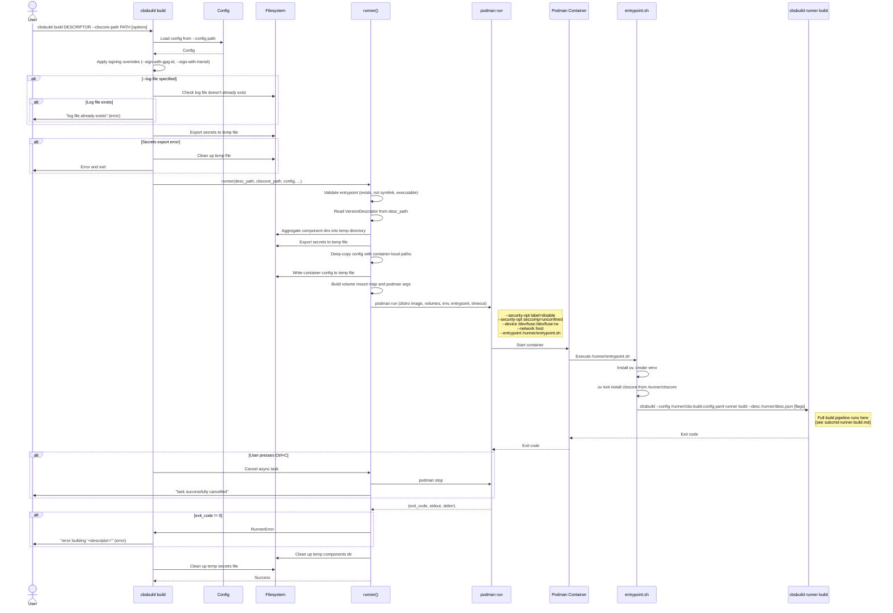
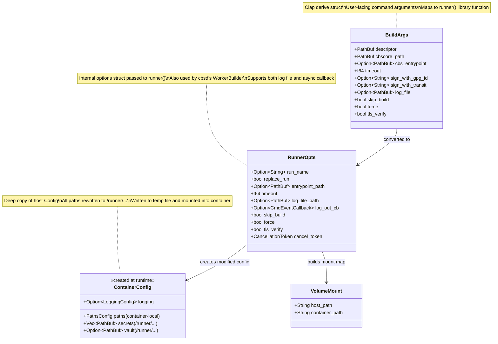

# Subcommand: `cbsbuild build`

## Description

`cbsbuild build` is the **host-side** command that launches a containerized build. It does not perform any compilation itself — instead, it prepares the environment (secrets, config, components), launches a Podman container using the target distro as the base image, and delegates the actual build work to `cbsbuild runner build` running inside that container.

This is the primary user-facing command for triggering builds. It is also called programmatically by `cbsd`'s worker via the `runner()` library function.

### What it does

1. **Loads config** — reads the CBS build config file
2. **Applies signing overrides** — CLI flags `--sign-with-gpg-id` and `--sign-with-transit` override config signing settings
3. **Validates log file** — if `--log-file` specified, ensures it doesn't already exist
4. **Exports secrets** — extracts secrets from config to a temp YAML file for container mounting
5. **Validates entrypoint** — checks the entrypoint script exists, is a file (not symlink), and is executable
6. **Reads version descriptor** — loads and validates the JSON descriptor
7. **Aggregates component dirs** — copies all component definition directories into a single temp directory
8. **Creates container config** — deep-copies the host config with all paths rewritten to container-local `/runner/...` mount points
9. **Launches Podman container** with:
   - Base image: the distro from the version descriptor (e.g., `rockylinux:9`)
   - Volume mounts for: descriptor, cbscore source, entrypoint, config, secrets, vault config, scratch, containers storage, components, ccache, logs
   - Device: `/dev/fuse` (for Buildah overlay mounts inside the container)
   - Security: `label=disable`, `seccomp=unconfined`
   - Network: host networking
   - Entrypoint: `/runner/entrypoint.sh`
10. **Streams output** — optionally to a log file or async callback
11. **Handles Ctrl+C** — cancels the async task, stops the container gracefully
12. **Cleans up** — removes temp files (secrets, config, components) on exit

### CLI signature

```
cbsbuild build DESCRIPTOR [OPTIONS]

Arguments:
  DESCRIPTOR              Path to the version descriptor JSON file (required)

Options:
  --cbscore-path PATH     Path to the CBS source directory (required)
  -e, --cbs-entrypoint PATH
                          Custom entrypoint script [default: _tools/cbscore-entrypoint.sh]
  --timeout SECONDS       Max build duration [default: 14400 (4 hours)]
  --sign-with-gpg-id ID  GPG secret ID for RPM signing
  --sign-with-transit ID  Vault Transit secret ID for image signing
  --log-file PATH         Write build logs to file
  --skip-build            Skip RPM building
  --force                 Force rebuild (ignore caches)
  --tls-verify BOOL       Verify TLS for registry [default: true]
```

Inherits from parent `cbsbuild`:
```
  -d, --debug             Enable debug output
  -c, --config PATH       Path to configuration file [default: cbs-build.config.yaml]
```

### Volume mount mapping

| Host path | Container path | Purpose |
|-----------|---------------|---------|
| `<descriptor>` | `/runner/<descriptor.name>` | Version descriptor JSON |
| `--cbscore-path` | `/runner/cbscore` | CBS source for `uv tool install` |
| Entrypoint script | `/runner/entrypoint.sh` | Container entrypoint |
| Temp config YAML | `/runner/cbs-build.config.yaml` | Rewritten config with container paths |
| Temp secrets YAML | `/runner/cbs-build.secrets.yaml` | Exported secrets |
| `config.vault` | `/runner/cbs-build.vault.yaml` | Vault auth config |
| `config.paths.scratch` | `/runner/scratch` | Build scratch space |
| `config.paths.scratch_containers` | `/var/lib/containers:Z` | Buildah container storage |
| Aggregated components dir | `/runner/components` | Component definitions |
| `config.paths.ccache` | `/runner/ccache` | Compiler cache (optional) |

Note: The Python code sets `LoggingConfig(log_file=Path("/runner/logs/cbs-build.log"))` in the container config when `--log-file` is specified, but `/runner/logs/` is never volume-mounted. The container-side log file is ephemeral. The actual host-side log capture works via the podman output callback (`output_cb`), which writes to the `--log-file` path on the host. The Rust implementation should either omit `LoggingConfig` from the container config or document this as a known inconsistency from the Python code.

### Entrypoint script behavior

The entrypoint (`cbscore-entrypoint.sh`) runs inside the container:
1. Installs `uv` from astral.sh
2. Creates a Python venv
3. Installs `cbsbuild` via `uv tool install` from the mounted cbscore source
4. Calls `cbsbuild --config /runner/cbs-build.config.yaml runner build <args>`

---

## Sequence Diagram



---

## Class Diagram



---

## Rust Implementation Plan

### Crate: `cbsbuild` (CLI binary)

**File**: `rust/cbsbuild/src/cmds/builds.rs`

### Clap structure

```rust
use clap::Args;
use std::path::PathBuf;

#[derive(Args)]
pub struct BuildArgs {
    /// Path to the version descriptor JSON file
    descriptor: PathBuf,

    /// Path to the CBS source directory
    #[arg(long = "cbscore-path")]
    cbscore_path: PathBuf,

    /// Custom entrypoint script
    #[arg(short = 'e', long = "cbs-entrypoint")]
    cbs_entrypoint: Option<PathBuf>,

    /// Max build duration in seconds
    #[arg(long, default_value_t = 14400.0)]
    timeout: f64,

    /// GPG secret ID for RPM signing
    #[arg(long = "sign-with-gpg-id")]
    sign_with_gpg_id: Option<String>,

    /// Vault Transit secret ID for image signing
    #[arg(long = "sign-with-transit")]
    sign_with_transit: Option<String>,

    /// Write build logs to file
    #[arg(long = "log-file")]
    log_file: Option<PathBuf>,

    /// Skip RPM building
    #[arg(long)]
    skip_build: bool,

    /// Force rebuild (ignore caches)
    #[arg(long)]
    force: bool,

    /// Verify TLS for registry communication.
    /// Uses BoolishValueParser to accept --tls-verify=true/false/True/False/1/0,
    /// matching Click's boolean option behavior.
    #[arg(long, default_value = "true", value_parser = clap::builder::BoolishValueParser::new())]
    tls_verify: bool,
}
```

### Implementation functions

```rust
/// Apply CLI signing overrides to the config.
fn apply_signing_overrides(
    config: &mut Config,
    gpg_id: Option<&str>,
    transit_id: Option<&str>,
) {
    if gpg_id.is_none() && transit_id.is_none() {
        return;
    }
    let signing = config.signing.get_or_insert_with(SigningConfig::default);
    if let Some(gpg) = gpg_id {
        signing.gpg = Some(gpg.to_string());
    }
    if let Some(transit) = transit_id {
        signing.transit = Some(transit.to_string());
    }
}

/// Validate the log file path (must not already exist).
fn validate_log_file(path: &Path) -> anyhow::Result<()> {
    if path.exists() {
        anyhow::bail!(
            "log file '{}' already exists, please remove it first",
            path.display()
        );
    }
    if let Some(parent) = path.parent() {
        std::fs::create_dir_all(parent)?;
    }
    Ok(())
}

/// Validate that secrets can be loaded from config (fail early).
/// The actual secrets temp file is created inside runner(), not here.
/// Note: The Python code creates a secrets temp file in cmd_build that
/// is never passed to runner() — this is dead code in Python that we
/// intentionally do not replicate.
fn validate_secrets(config: &Config) -> anyhow::Result<()> {
    config.get_secrets()
        .map_err(|e| anyhow::anyhow!("unable to obtain secrets from config: {e}"))?;
    Ok(())
}
```

### Command handler

```rust
/// Handle the `cbsbuild build` command.
///
/// Prepares the environment and launches a Podman container
/// that runs `cbsbuild runner build` inside.
pub async fn handle_build(
    config_path: &Path,
    args: BuildArgs,
) -> anyhow::Result<()> {
    let mut config = Config::load(config_path)
        .map_err(|e| anyhow::anyhow!("error loading config: {e}"))?;

    apply_signing_overrides(
        &mut config,
        args.sign_with_gpg_id.as_deref(),
        args.sign_with_transit.as_deref(),
    );

    if let Some(ref log_path) = args.log_file {
        validate_log_file(log_path)?;
    }

    // Validate secrets can be loaded (fail early before launching container).
    // The actual secrets temp file is created inside runner().
    validate_secrets(&config)?;

    let cancel_token = CancellationToken::new();
    let token_clone = cancel_token.clone();
    tokio::spawn(async move {
        let _ = tokio::signal::ctrl_c().await;
        tracing::info!("received interrupt, cancelling build...");
        token_clone.cancel();
    });

    runner(
        &args.descriptor,
        &args.cbscore_path,
        &config,
        RunnerOpts {
            run_name: None,
            replace_run: false,
            entrypoint_path: args.cbs_entrypoint,
            timeout: args.timeout,
            log_file_path: args.log_file,
            log_out_cb: None,
            skip_build: args.skip_build,
            force: args.force,
            tls_verify: args.tls_verify,
            cancel_token,
        },
    )
    .await
    .map_err(|e| anyhow::anyhow!("error building '{}': {e}", args.descriptor.display()))
}
```

### Library function: `runner()`

Located in `cbscore-lib/src/runner.rs`. This is the **shared** async function called by both the CLI (`handle_build`) and `cbsd`'s worker (`WorkerBuilder._do_build`).

```rust
/// Options for the runner.
pub struct RunnerOpts {
    pub run_name: Option<String>,
    pub replace_run: bool,
    pub entrypoint_path: Option<PathBuf>,
    pub timeout: f64,
    pub log_file_path: Option<PathBuf>,
    pub log_out_cb: Option<CmdEventCallback>,
    pub skip_build: bool,
    pub force: bool,
    pub tls_verify: bool,
    pub cancel_token: CancellationToken,
}

/// Launch a containerized build via Podman.
///
/// Validates the entrypoint, reads the descriptor, aggregates components,
/// creates a container-local config, and launches `podman run` with all
/// required volume mounts. Streams output via log file or callback.
pub async fn runner(
    desc_file_path: &Path,
    cbscore_path: &Path,
    config: &Config,
    opts: RunnerOpts,
) -> Result<(), RunnerError> { ... }
```

Internally decomposed into focused helpers:

```rust
/// Resolve and validate the entrypoint script path.
fn resolve_entrypoint(
    custom: Option<&Path>,
) -> Result<PathBuf, RunnerError> { ... }

/// Validate entrypoint: exists, is a file, not a symlink, executable.
fn validate_entrypoint(path: &Path) -> Result<(), RunnerError> { ... }

/// Aggregate component directories into a single temp directory.
fn setup_components_dir(
    components_paths: &[PathBuf],
) -> Result<TempDir, RunnerError> { ... }

/// Create a container-local config with rewritten paths.
fn create_container_config(
    config: &Config,
    log_file: bool,
) -> Config { ... }

/// Paths to mount into the build container.
struct MountSources<'a> {
    desc_path: &'a Path,
    cbscore_path: &'a Path,
    entrypoint: &'a Path,
    config_tmp: &'a Path,
    secrets_tmp: &'a Path,
    components_dir: &'a Path,
}

/// Build the volume mount map for podman.
fn build_volume_mounts(
    sources: &MountSources<'_>,
    config: &Config,
) -> HashMap<String, String> { ... }

/// Build the podman command-line arguments.
///
/// Includes `--security-opt label=disable` and `--security-opt seccomp=unconfined`
/// as mandated by the spec for nested container builds (Buildah-in-Podman).
fn build_podman_args(
    desc_mount_loc: &str,
    tls_verify: bool,
    skip_build: bool,
    force: bool,
) -> Vec<String> { ... }
```

### Graceful shutdown (Ctrl+C)

The Python code catches `KeyboardInterrupt` in `cmd_build`, cancels the asyncio task, and waits for cleanup. The Rust design must handle the fact that `runner()` is a shared library function called by both the CLI (`handle_build`) and the daemon (`cbsd`'s `WorkerBuilder`) — each caller needs different cancellation behavior.

**Approach**: `runner()` accepts a `tokio_util::sync::CancellationToken`. Internally, `runner()` monitors the token alongside `podman_run()` via `tokio::select!`. When cancelled, it stops the container and cleans up. Each caller controls cancellation differently:

```rust
// In runner() — monitors token alongside podman_run
tokio::select! {
    result = podman_run(/* ... */) => {
        result?;
    }
    _ = opts.cancel_token.cancelled() => {
        tracing::info!("build cancelled, stopping container...");
        podman_stop(Some(&container_name), 1).await?;
        tracing::info!("container stopped");
        return Err(RunnerError::Cancelled);
    }
}
```

```rust
// In handle_build() — CLI wires Ctrl+C to the token
let cancel_token = CancellationToken::new();
let token_clone = cancel_token.clone();

tokio::spawn(async move {
    let _ = tokio::signal::ctrl_c().await;
    tracing::info!("received interrupt, cancelling build...");
    token_clone.cancel();
});

runner(/* ..., */ RunnerOpts { /* ..., */ cancel_token }).await?;
```

```rust
// In cbsd's WorkerBuilder — daemon wires its own shutdown signal
let cancel_token = CancellationToken::new();
// Store token_clone for WorkerBuilder.shutdown() to call .cancel()
runner(/* ..., */ RunnerOpts { /* ..., */ cancel_token }).await?;
```

Add `tokio-util` to workspace dependencies.

### Temp file cleanup

Use `tempfile::NamedTempFile` and `tempfile::TempDir` for automatic RAII cleanup:
- Secrets temp file → `NamedTempFile` (auto-deleted on drop)
- Container config temp file → `NamedTempFile`
- Aggregated components dir → `TempDir` (auto-deleted on drop)

This replaces the Python `try/finally` cleanup pattern with Rust's `Drop` guarantees.

### Dependencies

- **Phase 3** (Config) — `Config` with `load()`, `store()`, `get_secrets()`, deep copy
- **Phase 4** (Secrets) — `Secrets` with `store()`
- **Phase 6** (Async cmd) — `CmdEventCallback` for log streaming
- **Phase 7b** (Podman) — `podman_run()`, `podman_stop()`
- **Phase 9** (Runner) — the `runner()` library function
- `tempfile` crate for RAII temp file/dir management
- `tokio::signal` for Ctrl+C handling

### Error handling

| Python exit code | Rust equivalent |
|-----------------|-----------------|
| `sys.exit(errno.ENOTRECOVERABLE)` — config load | Propagated from `Config::load()` |
| `sys.exit(errno.EEXIST)` — log file exists | `anyhow::bail!("log file already exists")` |
| `sys.exit(errno.ENOTRECOVERABLE)` — secrets error | Propagated from `export_secrets()` |
| `sys.exit(1)` — runner error | Propagated from `runner()` |
| `KeyboardInterrupt` | `tokio::signal::ctrl_c()` → graceful podman stop |

Temp files are cleaned up automatically by `Drop`, even on error paths.

### Tests

- **Unit**: `apply_signing_overrides()` — sets GPG/Transit on config, creates SigningConfig if absent
- **Unit**: `validate_log_file()` — rejects existing file, creates parent dirs
- **Unit**: `create_container_config()` — all paths rewritten to `/runner/...`
- **Unit**: `build_volume_mounts()` — verify all expected mounts, including optional vault/ccache
- **Unit**: `build_podman_args()` — verify flag combinations (skip_build, force, tls_verify)
- **Unit**: Temp file cleanup — verify no leaked files after success and error paths
- **Integration**: Launch a build with a test descriptor against Podman
- **Integration**: Ctrl+C cancellation stops the container
- **Snapshot**: `cbsbuild build --help` output matches baseline
