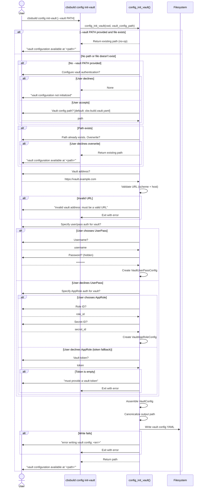
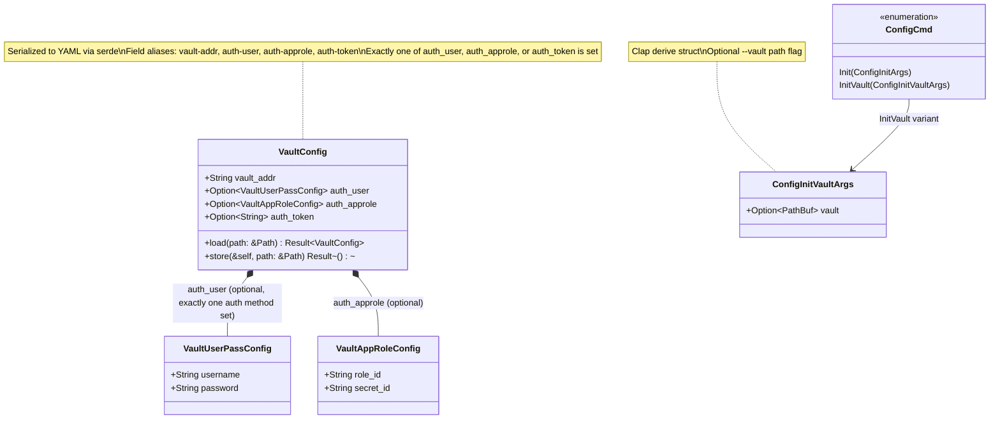

# Subcommand: `cbsbuild config init-vault`

## Description

`cbsbuild config init-vault` is a standalone interactive wizard that generates **only** the Vault authentication configuration file (default: `cbs-build.vault.yaml`). It is the same Vault configuration logic used by `config init`, extracted as its own command for cases where the main config already exists but Vault credentials need to be set up or rotated independently.

The generated file is referenced by the main config's `vault:` field and is loaded at runtime to authenticate against HashiCorp Vault for secrets retrieval.

### CLI signature

```
cbsbuild config init-vault [OPTIONS]

Options:
  --vault PATH    Specify vault config path
```

Inherits from parent `cbsbuild`:
```
  -d, --debug     Enable debug output
  -c, --config    Path to configuration file [default: cbs-build.config.yaml]
```

Note: Unlike `config init`, this command does **not** use the `--config`/`-c` parent option. It operates independently of the main config file.

### Behavior

1. If `--vault` path is provided and the file already exists → return immediately (use existing)
2. If no `--vault` path → ask if user wants to configure Vault at all
3. If user declines → exit with "vault configuration not initialized"
4. If no path provided → prompt for path (default: `cwd/cbs-build.vault.yaml`)
5. If path exists → ask for overwrite confirmation; if declined, return existing path
6. Prompt for Vault address
7. Prompt for auth method (one of three, in order):
   - **UserPass** → prompt username + password (hidden input)
   - **AppRole** → prompt role ID + secret ID
   - **Token** → prompt for token (required, exits with error if empty)
8. Assemble `VaultConfig`, write to YAML file
9. Print result path

### Output

A YAML file containing the Vault connection and authentication configuration:

```yaml
vault-addr: https://vault.example.com
auth-user:
  username: myuser
  password: mypassword
```

Or with AppRole:
```yaml
vault-addr: https://vault.example.com
auth-approle:
  role-id: abc-123
  secret-id: def-456
```

Or with token:
```yaml
vault-addr: https://vault.example.com
auth-token: hvs.CAESI...
```

---

## Sequence Diagram



---

## Class Diagram



---

## Rust Implementation Plan

### Crate: `cbsbuild` (CLI binary)

**File**: `rust/cbsbuild/src/cmds/config.rs` (same file as `config init`, shared module)

### Clap structure

```rust
#[derive(Args)]
pub struct ConfigInitVaultArgs {
    /// Vault config file path
    #[arg(long = "vault")]
    vault: Option<PathBuf>,
}
```

This is added to the existing `ConfigCmd` enum alongside `ConfigInitArgs`:

```rust
#[derive(Subcommand)]
pub enum ConfigCmd {
    /// Initialize the configuration file.
    Init(ConfigInitArgs),
    /// Initialize the vault configuration file.
    InitVault(ConfigInitVaultArgs),
}
```

### Implementation function

The `config_init_vault()` function is **shared** between `config init` and `config init-vault` — `config init` calls it as part of its wizard, and `config init-vault` calls it directly. This avoids duplication (DRY).

```rust
/// Prompt for the vault config output path, with a default.
fn prompt_vault_path(cwd: &Path) -> anyhow::Result<PathBuf> {
    let default = cwd.join("cbs-build.vault.yaml");
    Ok(Input::<PathBuf>::new()
        .with_prompt("Vault config path")
        .default(default)
        .interact_text()?)
}

/// Check if the file exists and ask for overwrite confirmation.
/// Returns true if we should proceed with writing.
fn confirm_overwrite(path: &Path) -> anyhow::Result<bool> {
    if !path.exists() {
        return Ok(true);
    }
    Ok(Confirm::new()
        .with_prompt(format!("Vault config path '{}' already exists. Overwrite?", path.display()))
        .interact()?)
}

/// Prompt for UserPass credentials.
fn prompt_userpass() -> anyhow::Result<VaultUserPassConfig> {
    let username: String = Input::new().with_prompt("Username").interact_text()?;
    let password = Password::new().with_prompt("Password").interact()?;
    Ok(VaultUserPassConfig { username, password })
}

/// Prompt for AppRole credentials.
fn prompt_approle() -> anyhow::Result<VaultAppRoleConfig> {
    let role_id: String = Input::new().with_prompt("Role ID").interact_text()?;
    let secret_id: String = Input::new().with_prompt("Secret ID").interact_text()?;
    Ok(VaultAppRoleConfig { role_id, secret_id })
}

/// Prompt for a Vault token (required, non-empty).
fn prompt_token() -> anyhow::Result<String> {
    let token: String = Input::new().with_prompt("Vault token").interact_text()?;
    if token.is_empty() {
        anyhow::bail!("must provide a vault token");
    }
    Ok(token)
}

/// Validate that a string is a valid URL with scheme and host.
fn validate_vault_addr(addr: &str) -> anyhow::Result<()> {
    let url = url::Url::parse(addr)
        .map_err(|e| anyhow::anyhow!("invalid vault address: {e}"))?;
    if url.host().is_none() {
        anyhow::bail!("invalid vault address: missing host");
    }
    if url.scheme() != "http" && url.scheme() != "https" {
        anyhow::bail!("invalid vault address: scheme must be http or https");
    }
    Ok(())
}

/// Prompt for the vault auth method and collect credentials.
fn prompt_vault_auth() -> anyhow::Result<VaultConfig> {
    let vault_addr: String = Input::new().with_prompt("Vault address").interact_text()?;
    validate_vault_addr(&vault_addr)?;

    let (auth_user, auth_approle, auth_token) =
        if Confirm::new().with_prompt("Specify user/pass auth for vault?").interact()? {
            (Some(prompt_userpass()?), None, None)
        } else if Confirm::new().with_prompt("Specify AppRole auth for vault?").interact()? {
            (None, Some(prompt_approle()?), None)
        } else {
            (None, None, Some(prompt_token()?))
        };

    Ok(VaultConfig { vault_addr, auth_user, auth_approle, auth_token })
}

/// Initialize vault configuration interactively.
///
/// Returns the path to the vault config file, or None if the user
/// declined to configure vault authentication.
pub fn config_init_vault(
    cwd: &Path,
    vault_config_path: Option<PathBuf>,
) -> anyhow::Result<Option<PathBuf>> {
    if let Some(ref path) = vault_config_path {
        if path.exists() {
            return Ok(Some(path.clone()));
        }
    }

    if !Confirm::new().with_prompt("Configure vault authentication?").interact()? {
        println!("skipping vault configuration");
        return Ok(None);
    }

    let vault_path = match vault_config_path {
        Some(p) => p,
        None => prompt_vault_path(cwd)?,
    };

    if !confirm_overwrite(&vault_path)? {
        return Ok(Some(vault_path));
    }

    let vault_config = prompt_vault_auth()?;
    let resolved_path = resolve_path(&vault_path, cwd);
    vault_config.store(&resolved_path)?;

    Ok(Some(resolved_path))
}
```

### Command handler

```rust
/// Handle the `cbsbuild config init-vault` command.
pub fn handle_config_init_vault(args: ConfigInitVaultArgs) -> anyhow::Result<()> {
    let cwd = std::env::current_dir()?;
    let path = config_init_vault(&cwd, args.vault)?;
    match path {
        Some(p) => println!("vault configuration available at '{}'", p.display()),
        None => println!("vault configuration not initialized"),
    }
    Ok(())
}
```

### Relationship to `config init`

The `config_init_vault()` function is used **only** by the standalone `config init-vault` command (`handle_config_init_vault()`). It is **not** called by `config init`.

In the Python code, `config_init()` (cmds/config.py:251-309) simply passes the vault path through to the `Config` constructor without running any interactive vault wizard. The `config init-vault` command is the only way to interactively create a vault configuration file.

### Dependencies

- **Phase 3** (Configuration System) must be complete — `VaultConfig`, `VaultUserPassConfig`, `VaultAppRoleConfig` structs with `store()` method. These structs must use `#[serde(rename_all = "kebab-case")]` to match the hyphenated YAML keys from the Python implementation (`vault-addr`, `auth-user`, `auth-approle`, `auth-token`, `role-id`, `secret-id`).
- `dialoguer` crate for interactive prompts
- `resolve_path()` helper (located in `rust/cbsbuild/src/cmds/utils.rs`)

### Error handling

| Python exit code | Rust equivalent |
|-----------------|-----------------|
| `sys.exit(errno.EINVAL)` — empty token | `anyhow::bail!("must provide a vault token")` |
| `sys.exit(errno.EIO)` — write failure | Propagated from `VaultConfig::store()` via `?` |

### Tests

- **Unit**: `config_init_vault()` with pre-existing path returns immediately
- **Unit**: `VaultConfig` YAML round-trip — assemble with each auth method, store, reload, compare
- **Unit**: YAML output uses correct field aliases (`vault-addr`, `auth-user`, `auth-approle`, `auth-token`)
- **Unit**: Exactly one auth field is set per config
- **Integration**: Run `cbsbuild config init-vault --vault /tmp/test-vault.yaml` in a temp dir, verify output file parses correctly
- **Snapshot**: `cbsbuild config init-vault --help` output matches baseline
eline
