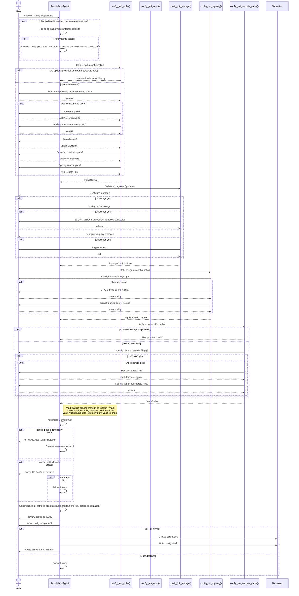
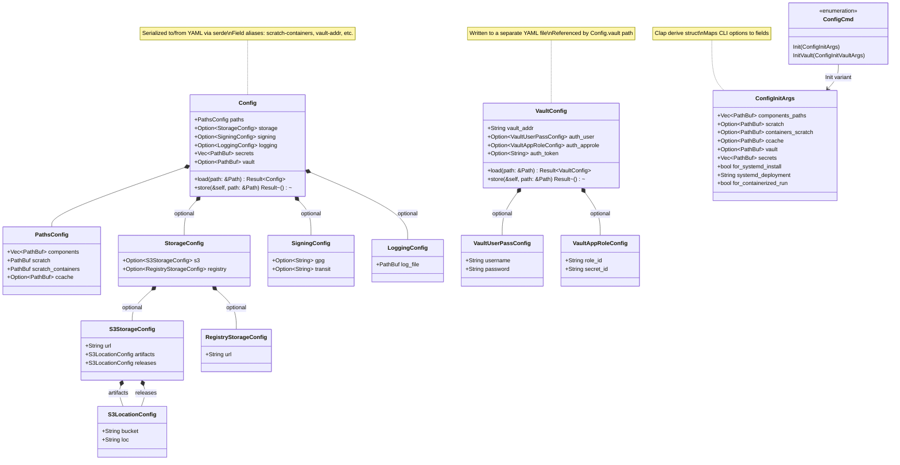

# Subcommand: `cbsbuild config init`

## Description

`cbsbuild config init` is an interactive wizard that generates the main CBS build configuration file (`cbs-build.config.yaml`). It walks the user through each configuration section via terminal prompts, assembles a `Config` object, previews the result as YAML, and writes it to disk after confirmation.

The command supports two shortcut modes that skip interactive prompts and pre-fill paths for standard deployment scenarios:
- `--for-systemd-install` — pre-fills container-standard paths and writes the config to `~/.config/cbsd/<deployment>/worker/cbscore.config.yaml`
- `--for-containerized-run` — pre-fills the same container-standard paths but uses the default config path

### CLI signature

```
cbsbuild config init [OPTIONS]

Options:
  --components PATH           Components directory path (repeatable)
  --scratch PATH              Scratch directory path
  --containers-scratch PATH   Containers scratch directory path
  --ccache PATH               Ccache directory path
  --vault PATH                Vault config file path
  --secrets PATH              Secrets file path (repeatable)
  --for-systemd-install       Pre-fill paths for systemd deployment
  --systemd-deployment TEXT   Systemd deployment name [default: default]
  --for-containerized-run     Pre-fill paths for containerized run
```

Inherits from parent `cbsbuild`:
```
  -d, --debug                 Enable debug output
  -c, --config PATH           Path to configuration file [default: cbs-build.config.yaml]
```

### Configuration sections collected

| Section | Interactive prompts | Pre-filled by shortcut flags |
|---------|-------------------|------------------------------|
| **Paths** | components dirs, scratch, containers-scratch, ccache | `/cbs/components`, `/cbs/scratch`, `/var/lib/containers`, `/cbs/ccache` |
| **Vault** | vault config file path + auth method | `/cbs/config/vault.yaml` |
| **Storage** | S3 URL/buckets/locations, registry URL | Not pre-filled (always interactive) |
| **Signing** | GPG secret name, Transit secret name | Not pre-filled (always interactive) |
| **Secrets** | paths to secrets files | `/cbs/config/secrets.yaml` |

### Output

A YAML file at the config path containing all sections. Example structure:

```yaml
paths:
  components:
    - /cbs/components
  scratch: /cbs/scratch
  scratch-containers: /var/lib/containers
  ccache: /cbs/ccache
storage:
  s3:
    url: https://s3.example.com
    artifacts:
      bucket: cbs-artifacts
      loc: builds/
    releases:
      bucket: cbs-releases
      loc: releases/
  registry:
    url: harbor.clyso.com
signing:
  gpg: my-gpg-key
  transit: my-transit-key
secrets:
  - /cbs/config/secrets.yaml
vault: /cbs/config/vault.yaml
```

---

## Sequence Diagram



---

## Class Diagram



---

## Rust Implementation Plan

### Crate: `cbsbuild` (CLI binary)

**File**: `rust/cbsbuild/src/cmds/config.rs`

### Clap structure

```rust
use clap::{Args, Subcommand};
use std::path::PathBuf;

#[derive(Subcommand)]
pub enum ConfigCmd {
    /// Initialize the configuration file.
    Init(ConfigInitArgs),
    /// Initialize the vault configuration file.
    InitVault(ConfigInitVaultArgs),
}

#[derive(Args)]
pub struct ConfigInitArgs {
    /// Components directory path (repeatable)
    #[arg(long = "components")]
    components_paths: Vec<PathBuf>,

    /// Scratch directory path
    #[arg(long)]
    scratch: Option<PathBuf>,

    /// Containers scratch directory path
    #[arg(long = "containers-scratch")]
    containers_scratch: Option<PathBuf>,

    /// Ccache directory path
    #[arg(long)]
    ccache: Option<PathBuf>,

    /// Vault config file path
    #[arg(long)]
    vault: Option<PathBuf>,

    /// Secrets file path (repeatable)
    #[arg(long)]
    secrets: Vec<PathBuf>,

    /// Initialize paths for a systemd install
    #[arg(long)]
    for_systemd_install: bool,

    /// Systemd deployment name
    #[arg(long, default_value = "default")]
    systemd_deployment: String,

    /// Initialize paths for a containerized run
    #[arg(long)]
    for_containerized_run: bool,
}
```

### Interactive prompt functions

Use the `dialoguer` crate for all interactive prompts. Map Python's Click prompt functions:

| Python (Click) | Rust (dialoguer) |
|----------------|-----------------|
| `click.confirm("message?")` | `dialoguer::Confirm::new().with_prompt("message?").interact()?` |
| `click.prompt("label", type=str)` | `dialoguer::Input::<String>::new().with_prompt("label").interact_text()?` |
| `click.prompt("label", default=val)` | `dialoguer::Input::new().with_prompt("label").default(val).interact_text()?` |
| `click.prompt("Password", hide_input=True)` | `dialoguer::Password::new().with_prompt("Password").interact()?` |

### Implementation functions

Each Python helper function maps to a Rust function:

```rust
// rust/cbsbuild/src/cmds/config.rs

use cbscore_types::config::*;
use dialoguer::{Confirm, Input, Password};
use std::path::{Path, PathBuf};

/// Options collected from CLI args for config initialization.
struct ConfigInitOptions {
    components: Option<Vec<PathBuf>>,
    scratch: Option<PathBuf>,
    containers_scratch: Option<PathBuf>,
    ccache: Option<PathBuf>,
    secrets: Option<Vec<PathBuf>>,
    vault: Option<PathBuf>,
}

/// Collect paths configuration interactively.
fn config_init_paths(
    cwd: &Path,
    components_paths: Option<Vec<PathBuf>>,
    scratch_path: Option<PathBuf>,
    containers_scratch_path: Option<PathBuf>,
    ccache_path: Option<PathBuf>,
) -> anyhow::Result<PathsConfig> { ... }

/// Collect storage configuration interactively.
fn config_init_storage() -> anyhow::Result<Option<StorageConfig>> { ... }

/// Collect signing configuration interactively.
fn config_init_signing() -> anyhow::Result<Option<SigningConfig>> { ... }

/// Collect secrets file paths interactively.
fn config_init_secrets_paths(
    secrets_files_paths: Option<Vec<PathBuf>>,
) -> anyhow::Result<Vec<PathBuf>> { ... }

/// Main orchestrator: collect all sections, preview, confirm, write.
/// Note: vault path is passed through as-is from opts.vault — no
/// interactive vault wizard runs here (use `config init-vault` for that).
fn config_init(
    config_path: &Path,
    cwd: &Path,
    opts: ConfigInitOptions,
) -> anyhow::Result<()> { ... }
```

### Command handler

The handler is split into small focused functions following the orchestrator + helpers pattern:

```rust
/// Pre-filled paths for systemd and containerized deployments.
struct ContainerDefaults;

impl ContainerDefaults {
    fn components() -> Vec<PathBuf> { vec![PathBuf::from("/cbs/components")] }
    fn scratch() -> PathBuf { PathBuf::from("/cbs/scratch") }
    fn containers_scratch() -> PathBuf { PathBuf::from("/var/lib/containers") }
    fn ccache() -> PathBuf { PathBuf::from("/cbs/ccache") }
    fn secrets() -> Vec<PathBuf> { vec![PathBuf::from("/cbs/config/secrets.yaml")] }
    fn vault() -> PathBuf { PathBuf::from("/cbs/config/vault.yaml") }
}

/// Convert CLI args to Option types (empty Vec → None).
fn args_to_options(args: &ConfigInitArgs) -> ConfigInitOptions {
    ConfigInitOptions {
        components: non_empty(args.components_paths.clone()),
        scratch: args.scratch.clone(),
        containers_scratch: args.containers_scratch.clone(),
        ccache: args.ccache.clone(),
        secrets: non_empty(args.secrets.clone()),
        vault: args.vault.clone(),
    }
}

/// Apply container defaults when shortcut flags are set.
fn apply_container_defaults(opts: &mut ConfigInitOptions) {
    opts.components = Some(ContainerDefaults::components());
    opts.scratch = Some(ContainerDefaults::scratch());
    opts.containers_scratch = Some(ContainerDefaults::containers_scratch());
    opts.ccache = Some(ContainerDefaults::ccache());
    opts.secrets = Some(ContainerDefaults::secrets());
    opts.vault = Some(ContainerDefaults::vault());
}

/// Resolve the config output path for systemd installs.
fn systemd_config_path(deployment: &str) -> PathBuf {
    dirs::home_dir()
        .expect("home directory")
        .join(format!(".config/cbsd/{deployment}/worker/cbscore.config.yaml"))
}

/// Handle the `cbsbuild config init` command.
pub fn handle_config_init(
    config_path: &Path,
    args: ConfigInitArgs,
) -> anyhow::Result<()> {
    let cwd = std::env::current_dir()?;
    let mut opts = args_to_options(&args);

    if args.for_systemd_install || args.for_containerized_run {
        apply_container_defaults(&mut opts);
    }

    let config_path = if args.for_systemd_install {
        systemd_config_path(&args.systemd_deployment)
    } else {
        config_path.to_path_buf()
    };

    config_init(&config_path, &cwd, opts)
}
```

### Path canonicalization

All paths collected interactively must be canonicalized to absolute paths before assembling the `Config` struct. This ensures the YAML output contains unambiguous, absolute paths regardless of how the user typed them (relative, with `~`, with `..`, etc.).

Located in `rust/cbsbuild/src/cmds/utils.rs` (shared across all config subcommands):

```rust
/// Canonicalize a path: resolve to absolute. Use std::fs::canonicalize
/// for existing paths, or join with cwd and normalize for non-existing ones.
pub fn resolve_path(path: &Path, cwd: &Path) -> PathBuf {
    if path.is_absolute() {
        path.to_path_buf()
    } else {
        cwd.join(path)
    }
}
```

Apply to: all `PathsConfig` fields (components, scratch, scratch_containers, ccache), secrets paths, vault config path, and the output config path itself.

Note: The Python code already calls `.resolve()` on interactively prompted paths. The shortcut flags use absolute paths (`/cbs/...`) so they don't need resolution.

### Config preview and write

The Python code does `json.loads(config.model_dump_json())` then `yaml.safe_dump()`. In Rust, split into focused helpers:

```rust
/// Render a Config as a YAML preview string.
fn config_to_yaml_preview(config: &Config) -> anyhow::Result<String> {
    let json_value = serde_json::to_value(config)?;
    Ok(serde_yml::to_string(&json_value)?)
}

/// Show YAML preview and ask for write confirmation.
fn confirm_write(config: &Config, path: &Path) -> anyhow::Result<()> {
    let preview = config_to_yaml_preview(config)?;
    println!("config:\n\n{preview}");

    if !Confirm::new()
        .with_prompt(format!("Write config to '{}'?", path.display()))
        .interact()?
    {
        anyhow::bail!("do not write config files");
    }
    Ok(())
}

/// Ensure parent directory exists, then write config to path.
fn write_config(config: &Config, path: &Path) -> anyhow::Result<()> {
    if let Some(parent) = path.parent() {
        std::fs::create_dir_all(parent)?;
    }
    config.store(path)?;
    println!("wrote config file to '{}'", path.display());
    Ok(())
}
```

### Dependencies

- **Phase 3** (Configuration System) must be complete — `Config`, `PathsConfig`, `StorageConfig`, `SigningConfig`, `VaultConfig` structs with `store()` method
- `dialoguer` crate for interactive prompts
- `serde_yml` for YAML preview and serialization
- `dirs` crate for `home_dir()` (systemd install path)
- `resolve_path()` helper (located in `rust/cbsbuild/src/cmds/utils.rs`)

### Error handling

| Python exit code | Rust equivalent |
|-----------------|-----------------|
| `sys.exit(errno.EINVAL)` | `anyhow::bail!("must provide a vault token")` |
| `sys.exit(errno.EIO)` | `anyhow::bail!("error writing vault config: {e}")` |
| `sys.exit(errno.ENOTRECOVERABLE)` | `anyhow::bail!("error writing config file: {e}")` |

All errors bubble up via `anyhow::Result` to the CLI main function which prints the error and exits with a non-zero code.

### Tests

- **Unit**: `config_init_paths()` with pre-filled values (no prompts) produces correct `PathsConfig`
- **Unit**: Shortcut flags pre-fill expected paths
- **Unit**: Config YAML round-trip — assemble Config, store, reload, compare
- **Unit**: `.yaml` extension enforcement
- **Integration**: Run `cbsbuild config init --for-containerized-run` in a temp dir, verify output file exists and parses correctly
- **Snapshot**: `cbsbuild config init --help` output matches baseline
