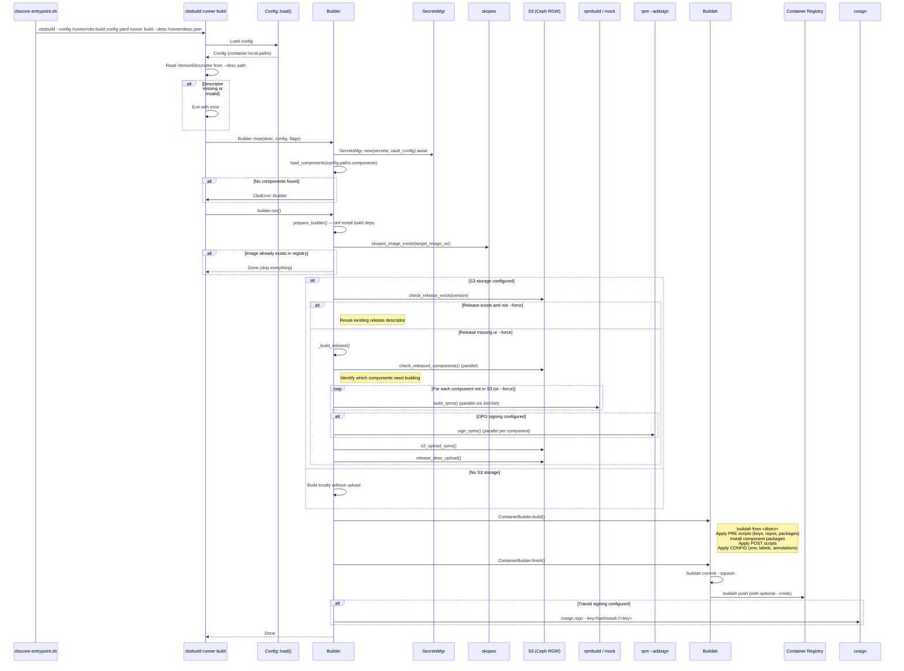

# Subcommand: `cbsbuild runner build`

## Description

`cbsbuild runner build` is an **internal command** that runs **inside** the Podman build container. It is not intended to be called by users directly — it is invoked by the entrypoint script (`cbscore-entrypoint.sh`) after `cbsbuild build` launches the container.

This command performs the actual build work: RPM compilation, signing, S3 upload, container image creation, and registry push. It is the container-side counterpart to the host-side `cbsbuild build` command.

### Why it exists

The CBS build architecture uses a two-layer model:
1. **Host side** (`cbsbuild build`) — prepares the environment, mounts volumes, launches a Podman container
2. **Container side** (`cbsbuild runner build`) — runs inside the container with all paths remapped to `/runner/...`, executes the full build pipeline

This separation ensures builds run in a clean, reproducible environment (the container's base distro) with proper isolation.

### What it does

1. **Loads config** — reads the container-local config file (mounted at `/runner/cbs-build.config.yaml`)
2. **Logs build parameters** — debug-level summary of all paths, signing, storage, and flags
3. **Reads version descriptor** — loads the JSON descriptor from the mounted path
4. **Initializes the Builder** — sets up secrets (Vault auth), loads component definitions, validates config
5. **Runs the build pipeline** (`Builder.run()`):
   - a. **Prepare builder** — install build dependencies via `dnf`
   - b. **Check image cache** — if container image already exists in registry → skip everything
   - c. **Check release cache** — if release exists in S3 for this version+arch → reuse it
   - d. **Build release** (if not cached):
     - Check S3 for individual component builds (reuse existing)
     - Build RPMs for missing components (parallel via `JoinSet`)
     - Sign RPMs with GPG (if configured)
     - Upload RPMs to S3
     - Upload release descriptor to S3
   - e. **Build container image** — Buildah: create from base distro, apply PRE/POST/CONFIG scripts, install packages
   - f. **Push and sign container** — commit image, push to registry, sign with Vault Transit (if configured)

### CLI signature

```
cbsbuild runner build [OPTIONS]

Options:
  --desc PATH         Path to version descriptor file (required)
  --skip-build        Skip building RPMs for components
  --force             Force the entire build (ignore caches)
  --tls-verify BOOL   Verify TLS for registry communication [default: true]
```

Inherits from parent `cbsbuild`:
```
  -d, --debug         Enable debug output
  -c, --config PATH   Path to configuration file [default: cbs-build.config.yaml]
```

Note: This command is hidden (`hidden = true` in Clap) — it does not appear in `cbsbuild --help`.

### Three-level caching

The build pipeline avoids redundant work at three levels:

| Level | Check | Skip condition |
|-------|-------|----------------|
| **Image** | `skopeo inspect` on target registry | Image already exists → skip everything |
| **Release** | Download `<version>.json` from S3 releases bucket | Release descriptor exists for this arch → skip to container build |
| **Component** | Download `<component>/<version>.json` from S3 | Component already built at correct version/arch/OS → reuse |

The `--force` flag bypasses release and component caches (but not the image cache — if the image exists, there's nothing to do).

---

## Sequence Diagram



---

## Rust Implementation Plan

> For domain types, see the Unified Class Diagram in [feature-cbscore-rs.md §3.4](feature-cbscore-rs.md).

### Crate: `cbsbuild` (CLI binary)

**File**: `rust/cbsbuild/src/cmds/builds.rs`

### Clap structure

```rust
use clap::{Args, Subcommand};
use std::path::PathBuf;

/// Build Runner related operations (internal use).
#[derive(Subcommand)]
#[command(hide = true)]
pub enum RunnerCmd {
    /// Perform a build (internal use). Use 'build' instead.
    Build(RunnerBuildArgs),
}

#[derive(Args)]
pub struct RunnerBuildArgs {
    /// Path to version descriptor file
    #[arg(long)]
    desc: PathBuf,

    /// Skip building RPMs for components
    #[arg(long)]
    skip_build: bool,

    /// Force the entire build (ignore caches)
    #[arg(long)]
    force: bool,

    /// Verify TLS for registry communication.
    /// Uses BoolishValueParser to accept --tls-verify=true/false/True/False/1/0,
    /// matching Click's boolean option behavior. Required because the runner
    /// passes `--tls-verify={value}` from the host to the container.
    #[arg(long, default_value = "true", value_parser = clap::builder::BoolishValueParser::new())]
    tls_verify: bool,
}
```

### Implementation functions

```rust
/// Extract display-friendly config summaries for logging.
fn config_summary(config: &Config) -> (String, String, String, String) {
    let upload = config.storage.as_ref()
        .and_then(|s| s.s3.as_ref())
        .map_or("not uploading".into(), |s| s.url.clone());
    let gpg = config.signing.as_ref()
        .and_then(|s| s.gpg.clone())
        .unwrap_or_else(|| "not signing with gpg".into());
    let transit = config.signing.as_ref()
        .and_then(|s| s.transit.clone())
        .unwrap_or_else(|| "not signing with transit".into());
    let registry = config.storage.as_ref()
        .and_then(|s| s.registry.as_ref())
        .map_or("not pushing to registry".into(), |r| r.url.clone());
    (upload, gpg, transit, registry)
}

/// Log a debug summary of all build parameters.
fn log_build_params(config: &Config, desc_path: &Path, flags: &BuildFlags) {
    let (upload, gpg, transit, registry) = config_summary(config);
    tracing::debug!(
        desc = %desc_path.display(),
        %upload, %gpg, %transit, %registry,
        ?flags, "runner build called"
    );
}

/// Load and validate the version descriptor from disk.
fn load_descriptor(path: &Path) -> anyhow::Result<VersionDescriptor> {
    if !path.exists() {
        anyhow::bail!("build descriptor does not exist at '{}'", path.display());
    }
    VersionDescriptor::read(path)
        .map_err(|e| anyhow::anyhow!("unable to read descriptor: {e}"))
}

/// Create and validate the Builder instance.
fn create_builder(
    desc: VersionDescriptor,
    config: &Config,
    flags: BuildFlags,
) -> anyhow::Result<Builder> {
    Builder::new(desc, config, flags)
        .map_err(|e| anyhow::anyhow!("unable to initialize builder: {e}"))
}
```

### Command handler

```rust
/// Handle the `cbsbuild runner build` command.
///
/// This runs inside the Podman build container. All paths in config
/// are container-local (e.g., /runner/scratch, /runner/components).
pub async fn handle_runner_build(
    config: &Config,
    args: RunnerBuildArgs,
) -> anyhow::Result<()> {
    let flags = BuildFlags {
        skip_build: args.skip_build,
        force: args.force,
        tls_verify: args.tls_verify,
    };
    log_build_params(config, &args.desc, &flags);

    let desc = load_descriptor(&args.desc)?;
    let builder = create_builder(desc, config, flags)?;

    builder.run().await
        .map_err(|e| anyhow::anyhow!("unable to run build: {e}"))
}
```

### Library: `Builder` struct

Located in `cbscore-lib/src/builder/build.rs`. This is the core build orchestrator.

```rust
/// The core build orchestrator.
///
/// Manages the full build pipeline: RPM compilation, signing,
/// S3 upload, container image creation, and registry push.
/// Implements three-level caching (image → release → component).
pub struct Builder {
    desc: VersionDescriptor,
    config: Config,
    scratch_path: PathBuf,
    components: HashMap<String, CoreComponentLoc>,
    storage_config: Option<StorageConfig>,
    signing_config: Option<SigningConfig>,
    secrets: SecretsMgr,
    ccache_path: Option<PathBuf>,
    flags: BuildFlags,
}
```

Key methods (each focused and short):

```rust
impl Builder {
    /// Initialize the builder: set up secrets, load components.
    pub fn new(
        desc: VersionDescriptor,
        config: &Config,
        flags: BuildFlags,
    ) -> Result<Self, CbsError> { ... }

    /// Run the full build pipeline.
    pub async fn run(&self) -> Result<(), CbsError> {
        self.prepare().await?;

        if self.image_already_exists().await? {
            return Ok(());
        }

        let release_desc = self.resolve_or_build_release().await?;

        if let Some(release) = release_desc {
            self.build_container(&release).await?;
        }

        Ok(())
    }

    // Internal helpers use anyhow::Result; errors are converted to
    // CbsError::Builder at the boundary (new/run methods above).

    /// Install build dependencies (dnf update/install).
    ///
    /// This includes installing `cosign` from a GitHub release RPM,
    /// as it is not available in standard Rocky Linux repositories.
    async fn prepare(&self) -> anyhow::Result<()> { ... }

    /// Check if the target image already exists in the registry.
    async fn image_already_exists(&self) -> anyhow::Result<bool> { ... }

    /// Check S3 for an existing release, or build a new one.
    async fn resolve_or_build_release(&self) -> anyhow::Result<Option<ReleaseDesc>> { ... }

    /// Build all components, sign, upload, create release descriptor.
    async fn build_release(&self) -> anyhow::Result<Option<ReleaseDesc>> { ... }

    /// Build RPMs for components that aren't already in S3.
    async fn build_rpms(
        &self,
        components: &HashMap<String, BuildComponentInfo>,
    ) -> anyhow::Result<HashMap<String, ComponentBuild>> { ... }

    /// Upload built RPMs and create release component descriptors.
    async fn upload(
        &self,
        infos: &HashMap<String, BuildComponentInfo>,
        builds: &HashMap<String, ComponentBuild>,
    ) -> anyhow::Result<HashMap<String, ReleaseComponentVersion>> { ... }

    /// Build the container image and push to registry.
    async fn build_container(
        &self,
        release: &ReleaseDesc,
    ) -> anyhow::Result<()> { ... }
}
```

### State checkpointing

As specified in the main plan (Phase 8), the builder checks for existing artifacts before each stage:

| Stage | Check | Artifact |
|-------|-------|----------|
| Image exists | `skopeo inspect` | Container image in registry |
| Release exists | S3 download `<version>.json` | Release descriptor |
| Component exists | S3 download `<component>/<version>.json` | Component build |

### Dependencies

Implemented in Phase 9. See [plan-cbscore-rs.md](plan-cbscore-rs.md).

### Error handling

Error handling follows [feature-cbscore-rs.md §5.2](feature-cbscore-rs.md): `anyhow::Result` internally, `CbsError` at module boundaries.

### Tests

- **Unit**: `log_build_params()` — verify structured log output with various config combinations
- **Unit**: `load_descriptor()` — valid JSON, missing file, malformed JSON
- **Unit**: Builder initialization — missing components dir, missing secrets
- **Unit**: State checkpointing — mock S3/registry responses to verify cache hit/miss logic
- **Unit**: Three-level caching — verify skip behavior at each level
- **Integration**: Full pipeline against a test environment with Podman, Buildah, Ceph RGW, and dev Vault
- **Integration**: `--force` flag bypasses release/component caches
- **Integration**: `--skip-build` flag skips RPM compilation
- **Snapshot**: `cbsbuild runner build --help` output matches baseline
