# Subcommand: `cbsbuild versions create`

## Description

`cbsbuild versions create` generates a **version descriptor** JSON file. A version descriptor is the primary input artifact for the build pipeline — it declares what to build (which components at which git refs), the target container image (registry, name, tag), the base distribution, and who signed off the build.

The command is used both interactively by developers (via the CLI) and programmatically by the CBS daemon (`cbsd`) via the `version_create_helper()` library function.

### What it does

1. **Reads the current git user** (name + email) from git config — used as the sign-off author
2. **Parses component refs** — each `--component NAME@VERSION` is split into a name→ref map
3. **Loads component definitions** — reads `cbs.component.yaml` files from `--components-path` directories (or `./components/` by default) to validate that each requested component exists and to look up its default git repo URI
4. **Applies URI overrides** — any `-o COMPONENT=URI` flags replace the default repo URI for that component
5. **Validates the version string** — must match `[prefix-]vM.m.p[-suffix]` (major, minor, patch all required)
6. **Generates a version title** — human-readable title derived from the version string, prefix, suffix, and version type (e.g., "Release Development CES version 24.11.0 (GA 1)")
7. **Assembles the `VersionDescriptor`** — all the above plus distro, EL version, image coordinates
8. **Writes the JSON file** — to `<output-dir>/<type>/<version>.json` (fails if it already exists)
9. **Checks for image descriptor** — warns if no matching image descriptor exists in the `desc/` directory (non-fatal)

### CLI signature

```
cbsbuild versions create VERSION [OPTIONS]

Arguments:
  VERSION                       Version string (format: [prefix-]vM.m.p[-suffix])

Options:
  -t, --type TYPE               Version type [default: dev] (release, dev, test, ci)
  -c, --component NAME@VERSION  Component ref (required, repeatable)
  --components-path PATH        Directory holding component definitions (repeatable)
  -o, --override-component-uri COMPONENT=URI
                                Override component git URI (repeatable)
  --distro NAME                 Base distribution [default: rockylinux:9]
  --el-version VERSION          EL version number [default: 9]
  --registry URL                Container registry [default: harbor.clyso.com]
  --image-name NAME             Container image name [default: ces/ceph/ceph]
  --image-tag TAG               Container image tag [default: VERSION string]
  --output-dir PATH             Output directory for version descriptors
                                [default: from config or <repo>/_versions]
```

Inherits from parent `cbsbuild`:
```
  -d, --debug                   Enable debug output
  -c, --config PATH             Path to configuration file [default: cbs-build.config.yaml]
```

### Output

A JSON file written to `<output-dir>/<version-type>/<version>.json`:

```json
{
  "version": "ces-v24.11.0-ga.1",
  "title": "Release Development CES version 24.11.0 (GA 1)",
  "signed_off_by": {
    "user": "Jane Developer",
    "email": "jane@clyso.com"
  },
  "image": {
    "registry": "harbor.clyso.com",
    "name": "ces/ceph/ceph",
    "tag": "ces-v24.11.0-ga.1"
  },
  "components": [
    {
      "name": "ceph",
      "repo": "https://github.com/ceph/ceph.git",
      "ref": "ces-v24.11.0-ga.1"
    }
  ],
  "distro": "rockylinux:9",
  "el_version": 9
}
```

---

## Sequence Diagram

```mermaid
sequenceDiagram
    actor User
    participant CLI as cbsbuild versions create
    participant Git as git utils
    participant Comp as load_components()
    participant Create as version_create_helper()
    participant FS as Filesystem
    participant ImgDesc as get_image_desc()

    User->>CLI: cbsbuild versions create VERSION [options]

    CLI->>Git: get_git_user()
    Git-->>CLI: (user_name, user_email)

    CLI->>CLI: parse_component_refs(--component args)
    Note right of CLI: Split "NAME@VERSION" → {name: ref}

    CLI->>Create: version_create_helper(version, type, refs, paths, ...)

    Create->>Create: Resolve components_paths (default: ./components/)
    Create->>Comp: load_components(paths)
    Comp->>FS: Read cbs.component.yaml files
    Comp-->>Create: {name: CoreComponentLoc}

    Create->>Create: Apply URI overrides (-o flags)
    Create->>Create: Validate version type
    Create->>Create: Validate version format (M.m.p required)
    Create->>Create: Generate version title
    Create->>Create: Assemble VersionDescriptor

    Create-->>CLI: VersionDescriptor

    CLI->>CLI: Print version + title

    CLI->>Git: get_git_repo_root()
    Git-->>CLI: repo_path

    CLI->>CLI: Resolve output path
    Note right of CLI: <output-dir>/<type>/<version>.json<br/>output-dir from: --output-dir flag,<br/>config field, or <repo>/_versions/

    alt Version file already exists
        CLI->>User: "version for <version> already exists" (error)
    end

    CLI->>FS: Create parent directories
    CLI->>CLI: Serialize descriptor to JSON (indent=2)
    CLI->>User: Print JSON preview
    CLI->>FS: Write descriptor JSON file
    CLI->>User: "-> written to <path>"

    CLI->>ImgDesc: get_image_desc(version)
    alt Image descriptor found
        Note right of CLI: Silent (no output)
    else Image descriptor missing
        CLI->>User: "image descriptor for version '<version>' missing" (warning)
    else Error checking
        CLI->>User: "error obtaining image descriptor: <err>" (warning)
    end
```

---

## Class Diagram

```mermaid
classDiagram
    direction TB

    class VersionDescriptor {
        +String version
        +String title
        +VersionSignedOffBy signed_off_by
        +VersionImage image
        +Vec~VersionComponent~ components
        +String distro
        +i32 el_version
        +read(path: &Path) Result~VersionDescriptor~
        +write(&self, path: &Path) Result~()~
        +model_dump_json(&self, indent: usize) String
    }

    class VersionSignedOffBy {
        +String user
        +String email
    }

    class VersionImage {
        +String registry
        +String name
        +String tag
    }

    class VersionComponent {
        +String name
        +String repo
        +String ref  (Rust field: r#ref or ref_ with serde rename)
    }

    VersionDescriptor *-- VersionSignedOffBy
    VersionDescriptor *-- VersionImage
    VersionDescriptor *-- VersionComponent : 1..*

    class VersionType {
        <<enumeration>>
        Release
        Dev
        Test
        Ci
    }

    class CoreComponent {
        +String name
        +String repo
        +CoreComponentBuildSection build
        +CoreComponentContainersSection containers
    }

    class CoreComponentLoc {
        +PathBuf path
        +CoreComponent comp
    }

    CoreComponentLoc *-- CoreComponent

    class VersionsCreateArgs {
        +String version
        +String version_type
        +Vec~String~ components
        +Vec~PathBuf~ components_paths
        +Vec~String~ component_uri_overrides
        +String distro
        +i32 el_version
        +String registry
        +String image_name
        +Option~String~ image_tag
        +Option~PathBuf~ output_dir
    }

    class VersionsCmd {
        <<enumeration>>
        Create(VersionsCreateArgs)
        List(VersionsListArgs)
    }

    VersionsCmd --> VersionsCreateArgs : Create variant

    note for VersionDescriptor "Serialized to JSON via serde\nField names match Python (snake_case)\nField order in struct declaration must match Python output\nfor consistent, human-reviewable JSON\nUsed as Pydantic field in cbsd's WorkerBuildEntry\nVersionComponent.ref must use #[serde(rename = 'ref')]\nbecause 'ref' is a Rust keyword (use r#ref or ref_ as field name)"
    note for VersionType "Maps to Python StrEnum\nMust serialize to lowercase via #[serde(rename_all = lowercase)]\nUsed directly for output directory naming and title generation"
    note for CoreComponentLoc "Loaded from cbs.component.yaml\nValidates that requested components exist"
    note for VersionsCreateArgs "Clap derive struct\nMaps CLI options to fields"
```



---

## Rust Implementation Plan

### Crate: `cbsbuild` (CLI binary)

**File**: `rust/cbsbuild/src/cmds/versions.rs`

### Clap structure

```rust
use clap::{Args, Subcommand};
use std::path::PathBuf;

#[derive(Subcommand)]
pub enum VersionsCmd {
    /// Create a new version descriptor file.
    Create(VersionsCreateArgs),
    /// List known release versions from S3.
    List(VersionsListArgs),
}

#[derive(Args)]
pub struct VersionsCreateArgs {
    /// Version string (format: [prefix-]vM.m.p[-suffix])
    version: String,

    /// Version type
    #[arg(short = 't', long = "type", default_value = "dev")]
    version_type: String,

    /// Component refs (NAME@VERSION, repeatable, required)
    #[arg(short = 'c', long = "component", required = true)]
    components: Vec<String>,

    /// Path to directory holding component definitions (repeatable)
    #[arg(long = "components-path")]
    components_paths: Vec<PathBuf>,

    /// Override component git URI (COMPONENT=URI, repeatable)
    #[arg(short = 'o', long = "override-component-uri")]
    component_uri_overrides: Vec<String>,

    /// Base distribution
    #[arg(long, default_value = "rockylinux:9")]
    distro: String,

    /// EL version number
    #[arg(long = "el-version", default_value_t = 9)]
    el_version: i32,

    /// Container registry
    #[arg(long, default_value = "harbor.clyso.com")]
    registry: String,

    /// Container image name
    #[arg(long = "image-name", default_value = "ces/ceph/ceph")]
    image_name: String,

    /// Container image tag (defaults to VERSION)
    #[arg(long = "image-tag")]
    image_tag: Option<String>,

    /// Output directory for version descriptors
    #[arg(long = "output-dir")]
    output_dir: Option<PathBuf>,
}
```

### Output directory resolution

The output directory is resolved from three sources (first wins):

1. `--output-dir` CLI flag
2. `versions_dir` field in the config file (new field added in this rewrite)
3. `<git-repo-root>/_versions/` (hardcoded fallback)

```rust
/// Resolve the output directory for version descriptors.
async fn resolve_output_dir(
    cli_output_dir: Option<&Path>,
    config_versions_dir: Option<&Path>,
) -> anyhow::Result<PathBuf> {
    if let Some(dir) = cli_output_dir {
        return Ok(dir.to_path_buf());
    }
    if let Some(dir) = config_versions_dir {
        return Ok(dir.to_path_buf());
    }
    let repo_root = get_git_repo_root().await?;
    Ok(repo_root.join("_versions"))
}
```

The config model (`Config` in `cbscore-types`) gains an optional field:

```rust
pub struct Config {
    // ... existing fields ...
    /// Directory for storing version descriptors.
    #[serde(rename = "versions-dir")]
    pub versions_dir: Option<PathBuf>,
}
```

### Implementation functions

Split into focused helpers following the orchestrator pattern:

```rust
/// Fetch the git user (name, email) for sign-off.
async fn get_sign_off() -> anyhow::Result<(String, String)> {
    get_git_user().await
        .map_err(|e| anyhow::anyhow!("error obtaining git user info: {e}"))
}

/// Determine the output file path and check it doesn't already exist.
fn resolve_descriptor_path(
    output_dir: &Path,
    version_type: &str,
    version: &str,
) -> anyhow::Result<PathBuf> {
    let path = output_dir
        .join(version_type)
        .join(format!("{version}.json"));
    if path.exists() {
        anyhow::bail!("version for {version} already exists");
    }
    Ok(path)
}

/// Write the descriptor JSON and print confirmation.
fn write_descriptor(
    desc: &VersionDescriptor,
    path: &Path,
) -> anyhow::Result<()> {
    if let Some(parent) = path.parent() {
        std::fs::create_dir_all(parent)?;
    }
    // Serde serializes fields in declaration order by default.
    // The VersionDescriptor struct field order must match the Python
    // output (version, title, signed_off_by, image, components,
    // distro, el_version) for consistent, human-reviewable JSON.
    let json = serde_json::to_string_pretty(desc)?;
    println!("{json}");
    desc.write(path)?;
    println!("-> written to {}", path.display());
    Ok(())
}

/// Check for a matching image descriptor (non-fatal warning).
async fn check_image_descriptor(version: &str) {
    match get_image_desc(version).await {
        Ok(_) => {}
        Err(CbsError::NoSuchVersion(_)) => {
            eprintln!("image descriptor for version '{version}' missing");
        }
        Err(e) => {
            eprintln!("error obtaining image descriptor for '{version}': {e}");
        }
    }
}
```

### Command handler

```rust
/// Handle the `cbsbuild versions create` command.
pub async fn handle_versions_create(
    config: Option<&Config>,
    args: VersionsCreateArgs,
) -> anyhow::Result<()> {
    let (user_name, user_email) = get_sign_off().await?;

    // Parse raw CLI strings into maps before calling the library function.
    // This matches the Python flow where cmds/versions.py parses first,
    // and allows cbsd to pass dicts directly via PyO3.
    let component_refs = parse_component_refs(&args.components)?;
    let uri_overrides = parse_uri_overrides(&args.component_uri_overrides)?;

    let desc = version_create_helper(
        &args.version,
        &args.version_type,
        &component_refs,
        &args.components_paths,
        &uri_overrides,
        &args.distro,
        args.el_version,
        &args.registry,
        &args.image_name,
        args.image_tag.as_deref(),
        &user_name,
        &user_email,
    )?;

    println!("version: {}", desc.version);
    println!("version title: {}", desc.title);

    let config_versions_dir = config.and_then(|c| c.versions_dir.as_deref());
    let output_dir = resolve_output_dir(
        args.output_dir.as_deref(),
        config_versions_dir,
    ).await?;

    let path = resolve_descriptor_path(
        &output_dir,
        &args.version_type,
        &desc.version,
    )?;

    write_descriptor(&desc, &path)?;
    check_image_descriptor(&desc.version).await;

    Ok(())
}
```

### Library function: `version_create_helper`

Located in `cbscore-lib/src/versions/create.rs`. This is the **shared** function called by both the CLI and `cbsd`'s worker. It is **not async** (all logic is pure computation + file reads).

```rust
/// Create a VersionDescriptor from the provided parameters.
///
/// This is the primary entry point for both CLI and daemon usage.
/// It validates inputs, loads components, applies overrides, and
/// assembles the descriptor.
///
/// Note: `component_refs` and `component_uri_overrides` are pre-parsed
/// maps (name → ref/uri). The CLI handler parses raw "NAME@VERSION" and
/// "COMPONENT=URI" strings before calling this function. This matches
/// the Python signature where cbsd passes dicts directly.
pub fn version_create_helper(
    version: &str,
    version_type_name: &str,
    component_refs: &HashMap<String, String>,
    components_paths: &[PathBuf],
    component_uri_overrides: &HashMap<String, String>,
    distro: &str,
    el_version: i32,
    registry: &str,
    image_name: &str,
    image_tag: Option<&str>,
    user_name: &str,
    user_email: &str,
) -> Result<VersionDescriptor, CbsError> { ... }
```

Internally splits into:
- `resolve_components_paths()` — default to `./components/` if empty
- `validate_and_create()` — calls `create()` which validates version, builds title, assembles descriptor

### Dependencies

- **Phase 2** (Version Management + Core Components) must be complete — `VersionDescriptor`, `VersionType`, `parse_component_refs()`, `parse_version()`, `load_components()`, `version_create_helper()`
- **Phase 7a** (Git wrappers) — `get_git_user()`, `get_git_repo_root()` (async)
- **Phase 7d** (Images) — `get_image_desc()` for the non-fatal warning check
- `resolve_path()` helper (located in `rust/cbsbuild/src/cmds/utils.rs`)
- Config model gains `versions_dir: Option<PathBuf>` field

### Error handling

| Python exit code | Rust equivalent |
|-----------------|-----------------|
| `sys.exit(1)` — git user error | `anyhow::bail!("error obtaining git user info: {e}")` |
| `sys.exit(errno.EINVAL)` — parse error | Propagated from `parse_component_refs()` |
| `sys.exit(errno.ENOTRECOVERABLE)` — create error | Propagated from `version_create_helper()` |
| `sys.exit(errno.EEXIST)` — file exists | `anyhow::bail!("version for {version} already exists")` |
| Image descriptor missing | Non-fatal `eprintln!` warning (no exit) |

### Tests

- **Unit**: `parse_component_refs()` — valid and malformed inputs (port from Python inline tests)
- **Unit**: `parse_version()` — ~30 test cases (port from Python's `versions/utils.py` inline tests)
- **Unit**: `normalize_version()` — ~18 test cases (port from Python)
- **Unit**: `version_create_helper()` — with fixture component dirs, verify JSON output structure
- **Unit**: Version title generation — various prefix/suffix combinations
- **Unit**: URI override parsing — valid `COMPONENT=URI` and malformed inputs
- **Unit**: Output path resolution — CLI flag > config field > git root fallback
- **Unit**: Reject duplicate version file (path already exists)
- **Integration**: `cbsbuild versions create` with a temp git repo and fixture components dir
- **Snapshot**: `cbsbuild versions create --help` output matches baseline
