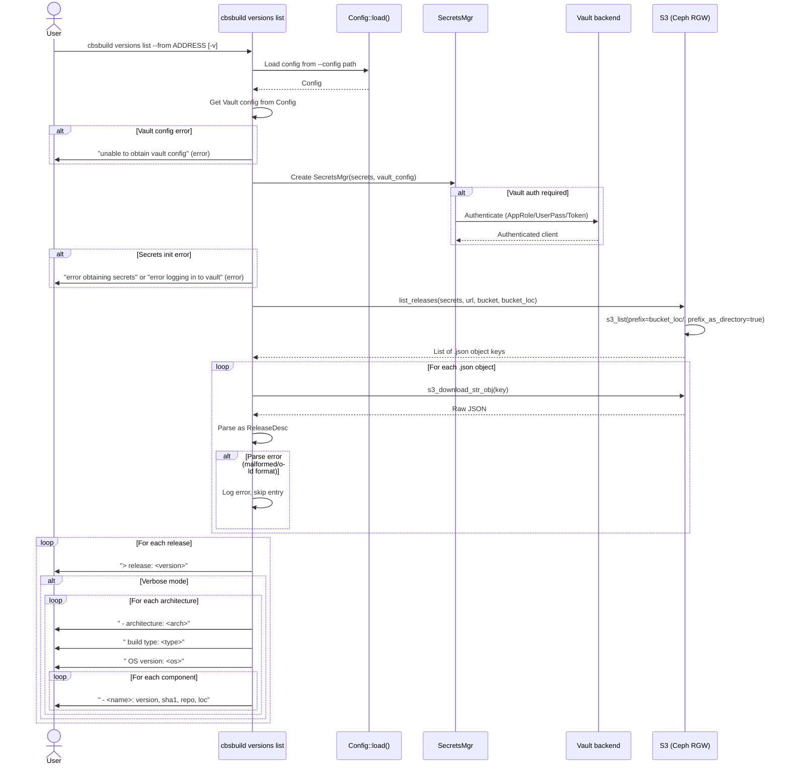

# Subcommand: `cbsbuild versions list`

## Description

`cbsbuild versions list` queries an S3-compatible object store and lists all published release versions. It reads release descriptor JSON files from the configured S3 releases bucket and displays them. With `-v/--verbose`, it expands each release to show per-architecture build details including components, versions, SHA1s, repository URLs, and artifact locations.

This command requires:
- A valid config file (loaded via `-c/--config`) with S3 storage and secrets configured
- Vault authentication (if secrets use Vault) to obtain S3 credentials

### What it does

1. **Loads config** — reads the CBS build config file
2. **Initializes secrets** — loads secrets from config, optionally authenticating to Vault
3. **Lists S3 objects** — fetches all `.json` files from the releases bucket location
4. **Downloads and parses** — fetches each release descriptor JSON and validates it
5. **Displays results** — prints version names, and optionally architecture/component details

### CLI signature

```
cbsbuild versions list [OPTIONS]

Options:
  -v, --verbose       Show additional release information
  --from ADDRESS      Address to the S3 service to list from (required)
```

Inherits from parent `cbsbuild`:
```
  -d, --debug         Enable debug output
  -c, --config PATH   Path to configuration file [default: cbs-build.config.yaml]
```

### Output

Default (non-verbose):
```
> release: ces-v24.11.0-ga.1
> release: ces-v24.11.0-ga.2
> release: ces-v25.1.0-dev.1
```

Verbose (`-v`):
```
> release: ces-v24.11.0-ga.1
  - architecture: x86_64
    build type: rpm
    OS version: el9
    components:
      - ceph:
        version:  ces-v24.11.0-ga.1
        sha1: a1b2c3d4e5f6
        repo url: https://github.com/ceph/ceph.git
        loc: builds/ceph/ces-v24.11.0-ga.1/
```

### Known issue in Python implementation

The Python CLI passes `s3_address_url` (from `--from`) as a single string to `list_releases()`, but `list_releases()` in `releases/s3.py` expects four arguments: `(secrets, url, bucket, bucket_loc)`. This is a latent bug — the function signature was likely refactored without updating the call site. The Rust implementation resolves this by using S3 settings from the config file, with `--from` as an optional override for the S3 URL only.

---

## Sequence Diagram



---

## Rust Implementation Plan

> For domain types, see the Unified Class Diagram in [feature-cbscore-rs.md §3.4](feature-cbscore-rs.md).

### Crate: `cbsbuild` (CLI binary)

**File**: `rust/cbsbuild/src/cmds/versions.rs` (shared with `versions create`)

### Clap structure

```rust
#[derive(Args)]
pub struct VersionsListArgs {
    /// Show additional release information
    #[arg(short = 'v', long)]
    verbose: bool,

    /// Override S3 URL (defaults to config's storage.s3.url)
    #[arg(long = "from")]
    from_address: Option<String>,
}
```

Added to the existing `VersionsCmd` enum defined in [subcmd-versions-create.md](subcmd-versions-create.md).

### Implementation functions

```rust
/// Initialize the SecretsMgr from config (loads secrets, authenticates to Vault).
/// Located in `rust/cbsbuild/src/cmds/utils.rs` — shared by all commands needing S3/Vault.
async fn init_secrets(config: &Config) -> anyhow::Result<SecretsMgr> {
    let vault_config = config.get_vault_config()
        .map_err(|e| anyhow::anyhow!("unable to obtain vault config: {e}"))?;
    let secrets = config.get_secrets()
        .map_err(|e| anyhow::anyhow!("error obtaining secrets: {e}"))?;
    SecretsMgr::new(secrets, vault_config.as_ref()).await
        .map_err(|e| anyhow::anyhow!("error logging in to vault: {e}"))
}

/// Resolve S3 coordinates: --from overrides config URL, bucket/loc always from config.
fn resolve_s3_params<'a>(
    config: &'a Config,
    from_address: Option<&'a str>,
) -> anyhow::Result<(&'a str, &'a str, &'a str)> {
    let storage = config.storage.as_ref()
        .and_then(|s| s.s3.as_ref())
        .ok_or_else(|| anyhow::anyhow!("S3 storage not configured"))?;
    let url = from_address.unwrap_or(&storage.url);
    Ok((url, &storage.releases.bucket, &storage.releases.loc))
}

/// Print a single release entry (non-verbose: version only).
fn print_release_summary(version: &str) {
    println!("> release: {version}");
}

/// Print detailed build information for one architecture.
fn print_build_details(arch: &ArchType, build: &ReleaseBuildEntry) {
    println!("  - architecture: {}", arch);
    println!("    build type: {}", build.build_type);
    println!("    OS version: {}", build.os_version);
    println!("    components:");
    for (name, comp) in &build.components {
        print_component_details(name, comp);
    }
}

/// Print detailed component information.
fn print_component_details(name: &str, comp: &ReleaseComponentVersion) {
    println!("      - {name}:");
    println!("        version:  {}", comp.version);
    println!("        sha1: {}", comp.sha1);
    println!("        repo url: {}", comp.repo_url);
    println!("        loc: {}", comp.artifacts.loc);
}

/// Display all releases, optionally with verbose details.
fn display_releases(
    releases: &HashMap<String, ReleaseDesc>,
    verbose: bool,
) {
    for (version, entry) in releases {
        print_release_summary(version);
        if !verbose {
            continue;
        }
        for (arch, build) in &entry.builds {
            print_build_details(arch, build);
        }
    }
}
```

### Command handler

```rust
/// Handle the `cbsbuild versions list` command.
pub async fn handle_versions_list(
    config: &Config,
    args: VersionsListArgs,
) -> anyhow::Result<()> {
    let secrets = init_secrets(config).await?;
    let (url, bucket, bucket_loc) =
        resolve_s3_params(config, args.from_address.as_deref())?;

    let releases = list_releases(&secrets, url, bucket, bucket_loc).await
        .map_err(|e| anyhow::anyhow!("error obtaining releases: {e}"))?;

    display_releases(&releases, args.verbose);
    Ok(())
}
```

### Library function: `list_releases`

Located in `cbscore-lib/src/releases/s3.rs`. This is async — it performs S3 network operations.

```rust
/// List all published releases from S3.
///
/// Fetches all .json files from the releases bucket location,
/// parses each as a ReleaseDesc, and returns a map of version → descriptor.
/// Malformed entries are logged and skipped (not fatal).
///
/// Uses `tokio::task::JoinSet` to download and parse JSON descriptors
/// in parallel, improving performance over the sequential Python implementation.
pub async fn list_releases(
    secrets: &SecretsMgr,
    url: &str,
    bucket: &str,
    bucket_loc: &str,
) -> anyhow::Result<HashMap<String, ReleaseDesc>> { ... }
```

Note: The Python implementation has a FIXME about inefficient credential fetching (re-fetches S3 creds from Vault for each download). The Rust implementation should create the S3 client once and reuse it across all downloads.

### Dependencies

Implemented in Phase 8. See [plan-cbscore-rs.md](plan-cbscore-rs.md).

### Error handling

Error handling follows [feature-cbscore-rs.md §5.2](feature-cbscore-rs.md): `anyhow::Result` internally, `CbsError` at module boundaries.

### Tests

- **Unit**: `display_releases()` — verify output format for both non-verbose and verbose modes
- **Unit**: `resolve_s3_params()` — Some(from_address) overrides config URL; None uses config URL
- **Unit**: `ReleaseDesc` JSON round-trip with all nested types
- **Unit**: Malformed JSON entries are skipped without crashing
- **Integration**: `list_releases()` against Ceph RGW with pre-populated release descriptors
- **Snapshot**: `cbsbuild versions list --help` output matches baseline
